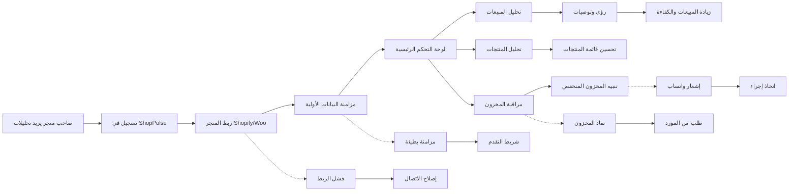

# JOURNEY MAP — ShopPulse (SAAS-005)
> Owner: Journey Architect · Gate 1 · Persona: مريم — صاحبة متجر ملابس

## المسار (Mermaid)

## تعليقات المراحل
| المرحلة | إجراء المستخدم | الهدف | المشاعر | الاحتكاك | الشاشة |
|----------|----------------|-------|---------|----------|--------|
| Signup | يسجل ويختار الخطة | بدء الاستخدام | 😊 متفائل | إدخال بيانات الدفع | Register |
| Connect | يدخل API Key المتجر | ربط البيانات | 😐 محايد | صعوبة إيجاد API Key | Integration |
| Sync | انتظار اكتمال المزامنة | رؤية البيانات | 😬 قلق | وقت المزامنة الطويل | Sync Progress |
| Dashboard | تصفح المؤشرات الرئيسية | فهم الأداء العام | 😊 راض | كثرة المؤشرات | KPI Dashboard |
| Sales | تحليل المبيعات بيانياً | معرفة الاتجاهات | 🙂 راض | فترات زمنية معقدة | Sales Chart |
| Alert | استلام تنبيه مخزون | تجنب نفاد المخزون | 😊 مطمئن | تنبيهات متكررة مزعجة | Alert Config |

## سجل الاحتكاك المرتب
1. [High] صعوبة ربط المتجر (API Key) → حل: معالج ربط خطوة بخطوة + تعليمات بالصور (Screen 2)
2. [High] المزامنة الأولية بطيئة → حل: شريط تقدم + إشعار عند الاكتمال (Screen 3)
3. [Med] كثرة المؤشرات في لوحة التحكم → حل: KPIs قابلة للتخصيص (Screen 4)
4. [Med] تنبيهات كثيرة مزعجة → حل: تحكم في إعدادات التنبيهات (Screen 5)
5. [Low] صعوبة تصدير التقارير → حل: زر تصدير (CSV/PDF) بنقرة واحدة (Screen 6)
