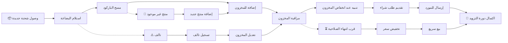

# JOURNEY MAP — InventoryPro (SAAS-035)
> Owner: Journey Architect · Gate 1 · Persona: عمر (مدير مستودع)

## Flow (Mermaid)

## Stage Annotations
| Stage | User Action | Goal | Emotion | Friction | Screen |
|-------|-------------|------|---------|----------|--------|
| Trigger | وصول شحنة من المورد | بدء الاستلام | 😊 متحمس | — | — |
| Receive | فتح الصناديق وفحصها | التأكد من الكمية | 😐 مركز | تلف بعض المنتجات | Receive PO |
| Scan | مسح باركود كل منتج | إدخال سريع | 🙂 سريع | باركود غير مقروء | Barcode Scanner |
| Stock In | إضافة الكميات للمخزون | تحديث آني | 😊 راضٍ | — | Stock Movement |
| Monitor | متابعة لوحة المخزون | مراقبة يومية | 😐 عادي | — | Dashboard |
| Alert | تنبيه بانخفاض المخزون | إعادة طلب | 😟 قلق | — | Alerts Panel |
| Reorder | إنشاء أمر شراء | طلب كميات | 😐 مركز | اختيار المورد | Purchase Order |
| Supplier | إرسال الطلب للمورد | تأمين التزويد | 😊 مرتاح | — | PO Send |

## Ranked Friction Log
1. **[High]** الجرد اليدوي بطيء ومتعب — مسح باركود + عد آلي
2. **[High]** نفاد المخزون المفاجئ — تنبيهات حد الطلب
3. **[High]** تواريخ انتهاء الصلاحية — تتبع الباتش + تنبيهات
4. **[Med]** اختيار المورد المناسب — سجل أسعار + أداء الموردين
5. **[Med]** الفرق بين المخزون الفعلي والنظام — جرد دوري مع تقارير الفرق

**Rule:** Every later feature MUST trace to a stage above.
