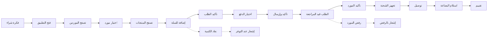
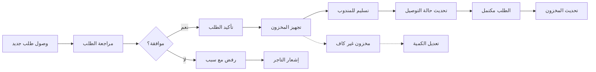

# JOURNEY MAP — SouqSync (SAAS-051)
> Owner: Journey Architect · Gate 1 · Persona: تاجر الجملة أبو عبدالله / صاحب المحل سارة

## Flow — Retailer Order Journey

## Flow — Supplier Order Management

## Stage Annotations
| Stage | User Action | Goal | Emotion | Friction | Screen |
|-------|-------------|------|---------|----------|--------|
| تصفح الموردين | اختيار فئة، بحث | إيجاد مورد مناسب | 😐 عادي | كثرة الخيارات | Browse Suppliers |
| اختيار المنتجات | إضافة للسلة | تكوين الطلب | 🤔 متحمس | عدم معرفة التوفر | Products Grid |
| تأكيد الطلب | مراجعة وإرسال | إنشاء طلب دقيق | 😊 راضٍ | أخطاء في الكمية | Cart/Checkout |
| انتظار التأكيد | تتبع الحالة | معرفة قبول الطلب | 😟 قلق | عدم تحديث الحالة | Order Detail |
| استلام البضاعة | فحص ومعاينة | استلام صحيح | 😊 راضٍ | نقص في الكمية | Delivery Receipt |
| إدارة المخزون (مورد) | تحديث المنتجات | عرض المخزون بدقة | 😐 عادي | إدخال يدوي | Supplier Inventory |

## Ranked Friction Log
1. [High] عدم معرفة توفر المخزون وقت الطلب — حل: عرض كميات حية مع إنذار عند النفاد
2. [High] أخطاء في كميات الطلب والمنتجات — حل: واجهة اختيار واضحة مع تأكيد مزدوج
3. [Med] تأخير تحديث حالة الطلب من المورد — حل: إشعارات فورية، مهلة زمنية للتأكيد
4. [Med] صعوبة مقارنة أسعار الموردين — حل: عرض أسعار مقارن بجانب كل منتج
5. [Low] إلغاء الطلب بعد الإرسال — حل: سياسة إلغاء واضحة، فترة سماح 15 دقيقة

**Rule:** Every later feature MUST trace to a stage above.
