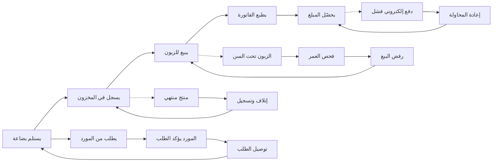

# JOURNEY MAP — TobaccoShop (SAAS-077)
> Owner: Journey Architect · Gate 1 · Persona: جابر (Shop Owner)

## Flow (Mermaid)

## Stage Annotations
| Stage | User Action | Goal | Emotion | Friction | Screen |
|-------|-------------|------|---------|----------|--------|
| استلام بضاعة | يستلم الطلب من المورد | تحديث المخزون | 😊 جاهز | أخطاء في الكميات | Receive Inventory |
| تسجيل مخزون | يمسح باركود المنتجات | مخزون دقيق | 😐 منتبه | بعض المنتجات بدون باركود | Stock Entry |
| بيع | يبيع للزبون ويحدد الكمية | بيع سريع | 😊 سريع | ازدحام على الدفع | POS Sale |
| فاتورة | تطبع الفاتورة للزبون | إيصال دقيق | 😊 تلقائي | ورق الفاتورة ينتهي | Receipt |
| تحصيل | الدفع نقداً أو بطاقة | تحصيل المبلغ | 😐 عادي | الشبكة تقطع | Payment |
| طلب شراء | يطلب بضاعة من المورد | تجديد المخزون | 😐 ضروري | أقل كمية للطلب | Purchase Order |
| مورد | تأكيد الطلب والسعر | اتفاق على الطلب | 😊 متفق | أسعار متغيرة | Supplier Confirm |
| توصيل | استلام الطلب من المورد | وصول البضاعة | 😊 مستلم | تأخير التوصيل | Delivery In |

## Ranked Friction Log
1. [High] التحقق من عمر العميل الزبون (قانوني، إجباري ومحرج)
2. [High] أخطاء في المخزون بسبب سرقة العمال أو خطأ في التسجيل
3. [Med] بعض منتجات الدخان لا تحمل باركود قابلاً للمسح
4. [Med] الموزعون يغيرون الأسعار بدون إشعار مسبق
5. [Low] ورق الفاتورة热 (thermal paper) يحتاج استبدال دوري
6. [Low] ازدحام على الدفع في أوقات الذروة

**Rule:** Every later feature MUST trace to a stage above.
