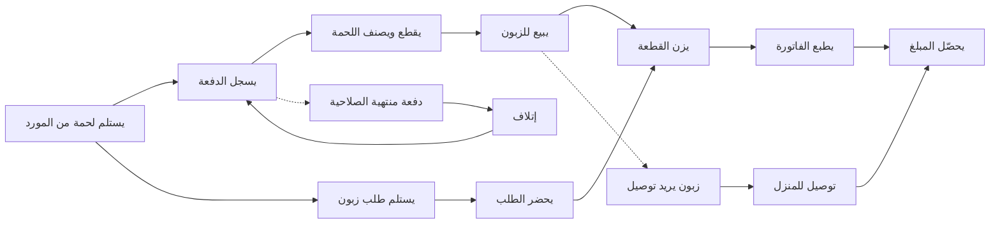

# JOURNEY MAP — ButcherPro (SAAS-078)
> Owner: Journey Architect · Gate 1 · Persona: منصور (Butcher)

## Flow (Mermaid)

## Stage Annotations
| Stage | User Action | Goal | Emotion | Friction | Screen |
|-------|-------------|------|---------|----------|--------|
| استلام لحمة | يدخل الدفعة الجديدة | توثيق المنشأ والتاريخ | 😊 جاهز | فاتورة المورد غير واضحة | Batch Entry |
| تسجيل دفعة | تحديد النوع والوزن والسعر | تتبع المخزون | 😐 منتبه | إدخال يدوي بطيء | Batch Record |
| تقطيع | تقطيع الذبيحة للقطع المختلفة | تحضير المنتجات للبيع | 😊 خبير | هدر في التقطيع | Cut Planning |
| بيع | الزبون يطلب قطعة محددة | بيع حسب الطلب | 😊 خدمة | أوزان متغيرة | Customer Order |
| وزن | وضع اللحمة على الميزان | وزن دقيق | 😊 دقيق | ميزان غير متصل | Weighing |
| فاتورة | طباعة الفاتورة مع الوزن والسعر | إيصال للزبون | 😊 سريع | حساب الضريبة | Receipt |
| تحصيل | الدفع نقداً أو بطاقة | تحصيل المبلغ | 😐 عادي | فكة نقدية | Payment |
| طلب توصيل | توجيه السائق للتوصيل | وصول الطلب للزبون | 😊 منظم | الزبون مش موجود | Delivery |

## Ranked Friction Log
1. [High] هدر اللحوم بسبب التقطيع غير المدروس (5-10% من الذبيحة تفقد)
2. [High] الزبائن يطلبون بالتلفون وينسى الجزار الطلب (في ساعات الذروة)
3. [Med] الميزان العادي لا يتصل بالنظام مباشرة (خطأ في إدخال الوزن يدوياً)
4. [Med] توثيق الشهادة الحلال مهم للزبائن لكن إثباتها صعب
5. [Low] فكة النقود في ساعات الصباح الباكر (المحلات ما عندها فكة)
6. [Low] معرفة أسعار الموردين المنافسين صعبة

**Rule:** Every later feature MUST trace to a stage above.
