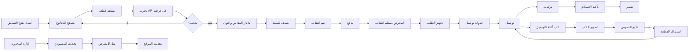

# JOURNEY MAP — FurniturePro (SAAS-090)
> Owner: Journey Architect · Gate 1 · Persona: عادل الصاعدي

## Flow (Mermaid)

## Stage Annotations
| Stage | User Action | Goal | Emotion | Friction | Screen |
|-------|-------------|------|---------|----------|--------|
| تصفح الكتالوج | عرض المنتجات والأقسام | اكتشاف الأثاث | 😊 مستكشف | كثرة الخيارات تربك | Catalog |
| AR المعاينة | توجيه الكاميرا للغرفة | تخيل القطعة في المنزل | 😊 متحمس | AR يحتاج إضاءة جيدة | AR Viewer |
| شراء | اختيار المقاس/اللون + دفع | إتمام الشراء | 😟 قلق | قد يتردد بسبب السعر | Checkout |
| تجهيز الطلب | تجهيز القطعة من المستودع | تحضير الشحن | 😐 روتيني | القطعة قد لا تكون متوفرة | Order Prep |
| توصيل | نقل الأثاث للعميل | وصول آمن | 😟 متوتر | الأثاث كبير وحساس | Delivery |
| تركيب | تركيب الأثاث في المنزل | تركيب احترافي | 😐 مركز | بعض القطع معقدة التركيب | Installation |

## Ranked Friction Log
1. [High] العملاء لا يشترون لأنهم لا يتخيلون القطعة في منزلهم
2. [High] التوصيل متأخر والتركيب غير منظم
3. [High] التلف أثناء التوصيل يسبب استبدال وخسارة
4. [Med] المساحة المادية لا تكفي لعرض كل المنتجات
5. [Med] تنسيق مواعيد التوصيل مع العملاء صعب

**Rule:** Every later feature MUST trace to a stage above.
