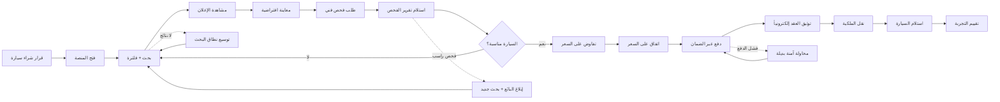

# JOURNEY MAP — AutoMarket (SAAS-100)
> Owner: Journey Architect · Gate 1 · Persona: فيصل المشتري

## التدفق (Mermaid)

## شروحات المراحل
| المرحلة | إجراء المستخدم | الهدف | المشاعر | الاحتكاك | الشاشة |
|---------|----------------|-------|---------|----------|--------|
| البحث | فلترة + مقارنة | إيجاد سيارة مناسبة | 😊 متفائل | إعلانات غير دقيقة | Search |
| المعاينة | صور + فيديو + تقرير | تقييم الحالة | 🤔 متحفظ | صور غير كافية | Preview |
| الفحص | طلب فحص معتمد | ضمان الجودة | 😰 قلق | تكلفة الفحص | Inspection |
| التفاوض | محادثة + عروض | اتفاق على السعر | 😬 متوتر | عروض غير جادة | Negotiation |
| الدفع | دفع آمن عبر escrow | حماية المبلغ | 💰 آمن | رسوم الضمان | Payment |
| التوثيق | عقد إلكتروني + نقل ملكية | ملكية قانونية | ✅ رسمي | إجراءات حكومية | Contract |

## سجل الاحتكاك المرتب
1. [High] الخوف من الاحتيال — فحص فني + تقرير حالة + ضمان
2. [High] تعقيد نقل الملكية — عقود إلكترونية + تكامل مع الإدارة
3. [Med] عدم الثقة في حالة السيارة — معاينة افتراضية 360°
4. [Med] دفع غير آمن — Escrow + استرجاع مضمون
5. [Low] تفاوض بدون جدية — مصادقة + تقييم بائع
