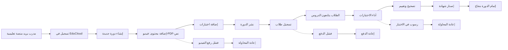

# JOURNEY MAP — EduCloud LMS (SAAS-006)
> Owner: Journey Architect · Gate 1 · Persona: سامي — مدرب مهارات

## المسار (Mermaid)

## تعليقات المراحل
| المرحلة | إجراء المستخدم | الهدف | المشاعر | الاحتكاك | الشاشة |
|----------|----------------|-------|---------|----------|--------|
| إنشاء دورة | يضيف عنوان ووصف وصورة | هيكلة الدورة | 🙂 راض | اختيار الإعدادات | Course Builder |
| إضافة محتوى | يرفع الفيديو ويكتب النص | إثراء المحتوى | 😐 مركز | رفع الفيديو بطيء | Lesson Editor |
| إضافة اختبار | يكتب أسئلة وخيارات | تقييم الفهم | 😊 منهجي | صعوبة صياغة الأسئلة | Quiz Builder |
| الطالب يتعلم | يشاهد الدرس ويقرأ | فهم المادة | 😊 متفاعل | فيديو بطيء التحميل | Lesson Player |
| إصدار شهادة | يكمل الدورة ويحصل على شهادة | توثيق الإنجاز | 😊 فخور | تأخر إصدار الشهادة | Certificate |

## سجل الاحتكاك المرتب
1. [High] رفع الفيديو بطيء → حل: رفع تدريجي مع شريط تقدم + تشفير تلقائي (Screen 2)
2. [High] لا اختبارات آلية التصحيح → حل: بنك أسئلة مع تصحيح تلقائي (Screen 3)
3. [Med] صعوبة تتبع تقدم الطلاب → حل: لوحة تقدم لكل طالب (Screen 5)
4. [Med] الشهادات اليدوية غير احترافية → حل: شهادات PDF مع QR (Screen 6)
5. [Low] لا تقارير أداء للدورات → حل: تقارير إتمام ونسب نجاح (Screen 7)
