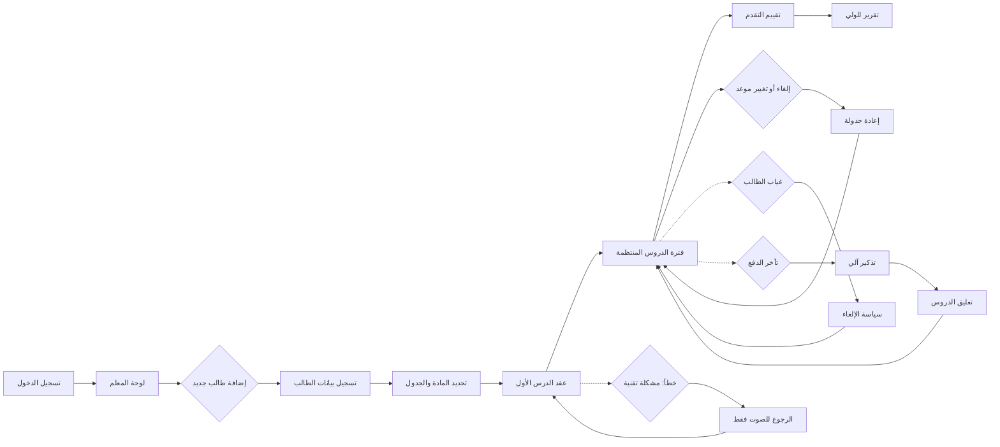

# JOURNEY MAP — TutorSpace (SAAS-019)
> Owner: Journey Architect · Gate 1 · Persona: نورة الشريف

## Flow (Mermaid)

## Stage Annotations
| Stage | User Action | Goal | Emotion | Friction | Screen |
|-------|-------------|------|---------|----------|--------|
| لوحة المعلم | عرض جدول الدروس القادمة والطلاب | نظرة على الأسبوع | إيجابية | كثرة الإشعارات | شاشة لوحة المعلم |
| إضافة طالب | إدخال بيانات الطالب والمادة | تسجيل طالب جديد | محايدة | نقص معلومات الطالب | نموذج طالب جديد |
| جدولة درس | اختيار الوقت والتاريخ المناسبين | تنظيم المواعيد | إيجابية | تعارض مع دروس أخرى | تقويم الجدولة |
| عقد الدرس | بدء الجلسة الافتراضية أو الحضورية | تقديم الدرس | إيجابية | مشاكل اتصال في الجلسة الافتراضية | غرفة الدرس |
| متابعة التقدم | تقييم أداء الطالب بعد كل درس | قياس التحسن | محايدة | صعوبة تتبع التقدم بدون معايير واضحة | شاشة التقييم |
| إعداد الفاتورة | إصدار فاتورة الدروس الشهرية | تحصيل المدفوعات | محايدة | حسابات يدوية معقدة | شاشة الفواتير |
| تقرير لولي الأمر | إرسال تقرير التقدم الأسبوعي | إبلاغ ولي الأمر | راضية | عدم تفاعل ولي الأمر مع التقرير | شاشة التقرير |

## Ranked Friction Log
1. [High] تعارض مواعيد الدروس خاصة عند تعدد الطلاب
2. [High] تأخير المدفوعات وعدم وجود نظام دفع آلي
3. [Med] جودة اتصال منخفضة في الفصول الافتراضية
4. [Med] عدم وجود سجل موحد لتقدم كل طالب
5. [Low] صعوبة إلغاء الحجوزات في اللحظة الأخيرة

**Rule:** Every later feature MUST trace to a stage above.
