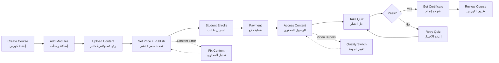

# JOURNEY MAP — CourseCraft (SAAS-048)
> Owner: Journey Architect · Gate 1 · Persona: د. عمر (مدرب)

## Flow (Mermaid)

## Stage Annotations
| Stage | User Action | Goal | Emotion | Friction | Screen |
|-------|-------------|------|---------|----------|--------|
| Create | يبدأ كورساً جديداً | بناء المنهج | 😊 متحمس | لا يعرف من أين يبدأ | Course Builder |
| Modules | يضيف وحدات ودروساً | تنظيم المحتوى | 🤔 مركز | ترتيب الدروس صعب بالتعديل | Module Editor |
| Upload | يرفع فيديو أو ينشئ اختباراً | إثراء المحتوى | 😐 محايد | رفع الفيديو بطيء | Lesson Editor |
| Publish | ينشر الكورس للبيع | بدء البيع | 😌 راضٍ | إعدادات الدفع معقدة | Publishing |
| Enroll | الطالب يسجل ويدفع | شراء الكورس | 😊 متحمس | الدفع يفشل أحياناً | Checkout |
| Learn | الطالب يشاهد الدروس ويختبر | اكتساب المهارة | 🤔 مركز | الفيديو يتقطع | Course Player |
| Certificate | يحصل على شهادة الإتمام | إثبات الإنجاز | 😊 فخور | الشهادة لا تحمل QR | Certificate |

## Ranked Friction Log
1. [High] رفع فيديو بطيء (ملفات كبيرة، لا تقدم واضح)
2. [High] الطلاب يواجهون تقطيع في الفيديو (يحتاج HLS + adaptive bitrate)
3. [Med] المدرب يحتاج تعديل الدروس بعد النشر
4. [Med] عملية الدفع معقدة للطلاب (لا يدعم Apple Pay/STC Pay)
5. [Low] الشهادات لا تحتوي QR للتحقق الإلكتروني
