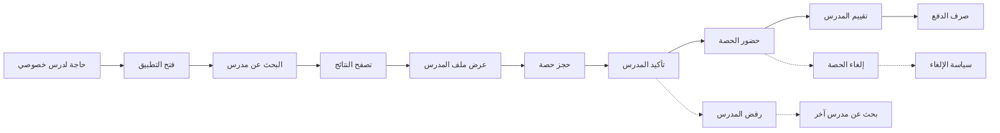
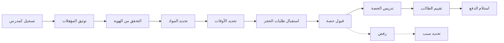

# JOURNEY MAP — TutorMatch (SAAS-058)
> Owner: Journey Architect · Gate 1 · Persona: الطالبة لين

## Flow — Student Tutoring Journey

## Flow — Tutor Journey

## Stage Annotations
| Stage | User Action | Goal | Emotion | Friction | Screen |
|-------|-------------|------|---------|----------|--------|
| البحث عن مدرس | إدخال المادة والتخصص | إيجاد المدرس المناسب | 😐 عادي | نتائج غير دقيقة | Tutor Search |
| عرض الملف | تقييم المؤهلات والتقييمات | اختيار أفضل مدرس | 🤔 مدقق | تقييمات قليلة | Tutor Profile |
| حجز الحصة | اختيار الوقت والتاريخ | جدولة الحصة | 😊 راضٍ | أوقات غير متاحة | Booking |
| حضور الحصة | الدردشة/اللقاء | التعلم والاستفادة | 🤔 مركز | اتصال ضعيف | Session |
| التقييم | تقييم متبادل | تحسين الجودة | 😐 عادي | تقييم غير دقيق | Rating |
| متابعة التقدم | مراجعة الأداء | تحسين النتائج | 😊 راضٍ | صعوبة قياس | Progress |

## Ranked Friction Log
1. [High] ضمان جودة المدرسين ومصداقيتهم — حل: تحقق صارم (هوية + مؤهل)، مقابلة، تقييم مستمر
2. [High] إلغاء الحصص في اللحظة الأخيرة — حل: دفع مسبق (escrow)، غرامة إلغاء، استبدال فوري
3. [Med] صعوبة إيجاد مدرس متخصص في المواد الجامعية — حل: تصنيف دقيق بالتخصص والمادة والمستوى
4. [Med] تأخر دفع أجور المدرسين — حل: إفراج تلقائي بعد انتهاء الحصة ب 24 ساعة
5. [Low] ضعف متابعة التقدم الأكاديمي للطالب — حل: لوحة تقدم، أهداف، تقارير دورية

**Rule:** Every later feature MUST trace to a stage above.
