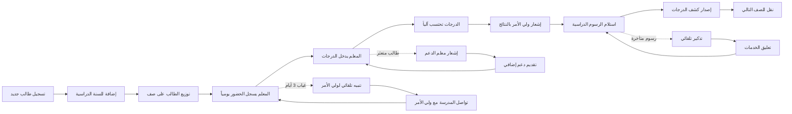

# JOURNEY MAP — SchoolEase (SAAS-067)
> Owner: Journey Architect · Gate 1 · Persona: أ. عبير — مديرة مدرسة

## Flow (Mermaid)

## Stage Annotations
| Stage | User Action | Goal | Emotion | Friction | Screen |
|-------|-------------|------|---------|----------|--------|
| تسجيل طالب | إدخال بيانات الطالب وولي الأمر | تسجيل سريع | 😊 متفائل | إدخال بيانات كثير (بطاقة العائلة) | Student Enrollment |
| الحضور اليومي | معلم يسجل الحضور في التطبيق | متابعة الانضباط | 😐 محايد | إدخال 25 طالب يومياً يستهلك وقتاً | Attendance |
| إدخال الدرجات | معلم يدخل درجات الاختبار | حساب النتيجة | 😓 مجهد | 25 طالب × 6 مواد = 150 درجة | Gradebook |
| التواصل مع ولي الأمر | إرسال نتيجة أو ملاحظة | إشراك الأسرة | 😊 مرتاح | الأهالي لا يقرؤون الإشعارات دائماً | Parent Communication |
| دفع الرسوم | ولي الأمر يدفع إلكترونياً | تحصيل مستحقات | 😌 راضٍ | بعض الأهالي لا يستخدمون الدفع الإلكتروني | Fee Payment |
| كشف الدرجات | توليد PDF وإرسال | توثيق النتائج | 😐 محايد | تنسيق الكشف يختلف حسب المرحلة | Report Card |

## Ranked Friction Log
1. [High] إدخال الدرجات يدوياً — يستهلك وقت المعلمين الثمين
2. [High] ضعف التواصل مع أولياء الأمور — شكاوى متكررة
3. [Med] تحصيل الرسوم — تأخر 20-30% من الرسوم عن موعدها
4. [Med] متابعة الطلاب المتعثرين — لا يوجد نظام إنذار مبكر
5. [Low] إعداد الجدول — صراعات في توزيع الحصص
6. [Low] استخراج التقارير — صعوبة للمديرة في اتخاذ القرارات

**Rule:** Every later feature MUST trace to a stage above.
