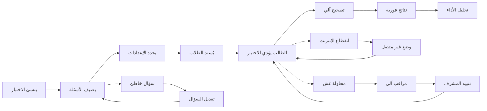

# JOURNEY MAP — ExamPro (SAAS-076)
> Owner: Journey Architect · Gate 1 · Persona: أ. أحمد (Professor)

## Flow (Mermaid)

## Stage Annotations
| Stage | User Action | Goal | Emotion | Friction | Screen |
|-------|-------------|------|---------|----------|--------|
| إنشاء | يكتب عنوان الاختبار وتعليماته | بدء بناء الاختبار | 😊 جاهز | واجهة غير مألوفة | Exam Builder |
| أسئلة | يضيف الأسئلة مع الإجابات | بناء بنك أسئلة متكامل | 😐 مركز | إدخال أسئلة مقالية معقد | Question Bank |
| إعدادات | يحدد الوقت والدرجات والعشوائية | اختبار متكامل | 🤔 منتبه | خيارات كثيرة ومربكة | Exam Settings |
| إسناد | يوزع الاختبار على الطلاب | إتاحة الاختبار للطلاب | 😊 سريع | تأكيد وصول الإشعار | Assign Exam |
| أداء | الطالب يجيب على الأسئلة | إتمام الاختبار | 😰 متوتر | وقت محدود | Exam Screen |
| تصحيح | النظام يصحح تلقائياً | نتائج فورية | 🤖 تلقائي | أسئلة مقالية تحتاج تدقيق | Auto-grade |
| نتائج | الطالب يرى نتيجته | معرفة الدرجة فوراً | 😊/😢 متفاوت | شرح الإجابات غير كاف | Results |
| تحليل | الأستاذ يحلل أداء الطلاب | معرفة نقاط الضعف والقوة | 😐 تحليلي | تقارير معقدة جداً | Analytics |

## Ranked Friction Log
1. [High] الأسئلة المقالية لا يمكن تصحيحها آلياً بالكامل (تحتاج تدخل أستاذ)
2. [High] انقطاع الإنترنت أثناء الاختبار يسبب قلقاً كبيراً للطلاب
3. [Med] بعض الأسئلة قد تحتوي على أخطاء في الإجابة النموذجية
4. [Med] واجهة إنشاء الاختبار معقدة للأستاذ غير التقني
5. [Low] إشعارات نتائج الاختبار تصل متأخرة لبعض الطلاب
6. [Low] التقارير التحليلية كثيرة جداً وقد تربك الأستاذ

**Rule:** Every later feature MUST trace to a stage above.
