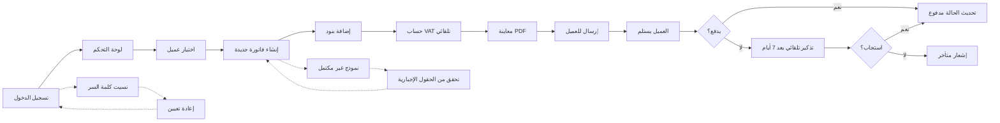

# JOURNEY MAP — InvoiceFlow (SAAS-022)
> Owner: Journey Architect · Gate 1 · Persona: نورة (مصممة جرافيك)

## Flow (Mermaid)

## Stage Annotations
| Stage | User Action | Goal | Emotion | Friction | Screen |
|-------|-------------|------|---------|----------|--------|
| دخول | يدخل البريد وكلمة السر | الوصول للوحة | 😐 | نسيت كلمة السر | Login |
| لوحة | يشوف ملخص الفواتير | نظرة سريعة على الوضع | 😊 | الأرقام تحتاج تفسير | Dashboard |
| فاتورة | يختار عميل وبنود | إصدار فاتورة صحيحة | 😐 | البحث عن عميل بطيء | Invoice Form |
| إرسال | يرسل الفاتورة | وصول العميل | 😊 | إيميل العميل خطأ | Send |
| متابعة | يتابع حالة الدفع | معرفة المدفوع | 😊 | لا إشعار عند الدفع | Tracking |
| تذكير | تذكير آلي | تحصيل المستحق | 😐 | العميل منزعج من التذكير | Reminder |

## Ranked Friction Log
1. [High] إضافة بنود يدوية في كل مرة → قوالب فواتير وبند متكرر
2. [High] أخطاء حساب VAT → حساب تلقائي مع تدقيق
3. [Med] البحث عن عميل بطيء → بحث ذكي مع اقتراحات
4. [Med] العميل لا يستلم الإيميل → إشعار بديل واتساب/SMS
5. [Low] تنسيق PDF لا يعجب العميل → قوابل PDF قابلة للتخصيص

**Rule:** Every later feature MUST trace to a stage above.
