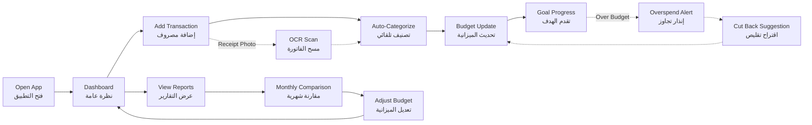

# JOURNEY MAP — BudgetWave (SAAS-047)
> Owner: Journey Architect · Gate 1 · Persona: ليان (موظفة)

## Flow (Mermaid)

## Stage Annotations
| Stage | User Action | Goal | Emotion | Friction | Screen |
|-------|-------------|------|---------|----------|--------|
| Dashboard | يفتح التطبيق ويرى نظرة عامة | معرفة الوضع المالي | 😊 فضول | البطئ في تحميل البيانات | Dashboard |
| Add Transaction | يدخل مصروفاً (يدوياً أو OCR) | تسجيل سريع | 🤔 مركز | التصنيف اليدوي متعب | Add Transaction |
| Auto-Categorize | التطبيق يصنف تلقائياً | توفير وقت | 😌 راضٍ | التصنيف خطأ أحياناً | Dashboard |
| Budget Update | يرى الميزانية تتحدث | متابعة الالتزام | 😰 قلق (إذا تجاوز) | لا يعرف كم تبقي | Budget View |
| Overspend | يتلقى إنذار تجاوز | تعديل السلوك | 😤 محبط | الإنذار يأتي متأخراً | Alert |
| Goal Progress | يرى تقدم هدف الادخار | تحفيز | 😊 سعيد | التقدم بطيء | Goals |

## Ranked Friction Log
1. [High] إدخال المصروفات يدوياً متعب — ينسى المستخدم
2. [High] التصنيف التلقائي يخطئ أحياناً (وجبات سريعة تصنف كصحة)
3. [Med] الإنذار بتجاوز الميزانية يأتي بعد فوات الأوان
4. [Med] لا توجد طريقة سهلة لتعديل الميزانية في منتصف الشهر
5. [Low] تتبع الفواتير الدورية يحتاج تفعيل يدوي
