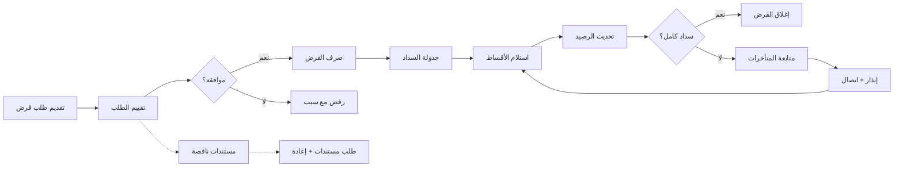
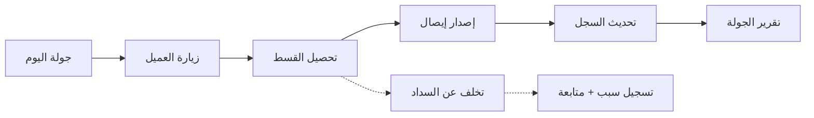

# JOURNEY MAP — MicroFund (SAAS-053)
> Owner: Journey Architect · Gate 1 · Persona: مدير المؤسسة سامي

## Flow — Loan Lifecycle

## Flow — Field Officer Collection

## Stage Annotations
| Stage | User Action | Goal | Emotion | Friction | Screen |
|-------|-------------|------|---------|----------|--------|
| تقديم طلب القرض | تعبئة نموذج الطلب | بدء التمويل | 😐 عادي | أوراق كثيرة | Loan Application |
| تقييم الطلب | مراجعة أهلية العميل | قرار تمويل سليم | 😟 قلق | نقص المعلومات | Client Evaluation |
| صرف القرض | تحويل المبلغ | إتمام التمويل | 😊 راضٍ | إجراءات الصرف | Disbursement |
| جدولة السداد | إعداد خطة الدفع | تنظيم الاسترداد | 😐 عادي | اختيار هيكل الدفع | Repayment Schedule |
| تحصيل الأقساط | استلام الدفع | استرداد التمويل | 🤔 مركز | تأخير العميل | Payment Collection |
| متابعة المتأخرات | اتصال بالعميل | تقليل الخسائر | 😟 متوتر | رفض العميل | Overdue Tracking |

## Ranked Friction Log
1. [High] نقص المعلومات عن العملاء عند التقييم الائتماني — حل: نقاط تقييم آلي، تكامل مع سجل credit bureau
2. [High] صعوبة تحصيل الأقساط ميدانياً — حل: تطبيق جوال للموظفين، دفع إلكتروني، SMS/واتساب
3. [Med] تعقيد حسابات الفائدة (خاصة الإسلامية) — حل: mode switch (ربوي/إسلامي)، حسابات آلية
4. [Med] إعداد تقارير المانحين يدوياً — حل: تقارير جاهزة قابلة للتخصيص، تصدير PDF/Excel
5. [Low] ضعف تواصل العملاء مع المؤسسة — حل: تطبيق عميل، إشعارات، استعلام عن الرصيد

**Rule:** Every later feature MUST trace to a stage above.
