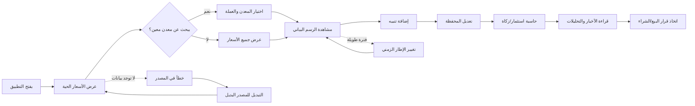

# JOURNEY MAP — GoldPrice (SAAS-065)
> Owner: Journey Architect · Gate 1 · Persona: أبو فيصل — تاجر ذهب

## Flow (Mermaid)

## Stage Annotations
| Stage | User Action | Goal | Emotion | Friction | Screen |
|-------|-------------|------|---------|----------|--------|
| فتح التطبيق | تشغيل التطبيق | رؤية سريعة للأسعار | 😊 متحمس | بطء التحميل يزعج التاجر (يحتاج فورية) | Live Prices |
| عرض الأسعار | النظر إلى لوحة الأسعار | معرفة سعر الشراء والبيع | 😐 مركز | كثرة الأرقام تربك المبتدئين | Price Board |
| الرسم البياني | اختيار إطار زمني ومؤشر | تحليل الاتجاه | 🤔 متفكر | المؤشرات كثيرة ومعقدة | Chart |
| إضافة تنبيه | تحديد سعر وشرط التنبيه | عدم تفويت فرصة | 😌 واثق | إعداد التنبيه يحتاج خطوات كثيرة | Alert Creator |
| المحفظة | إضافة صفقة شراء | تتبع الاستثمارات | 😊 راضٍ | إدخال بيانات الصفقة يدوياً | Portfolio |
| الحاسبة | اختيار نوع الحساب | معرفة القيمة أو الزكاة | 😐 محايد | وضوح النتيجة أحياناً مربك | Calculator |
| الأخبار | قراءة التحليل | فهم حركة السوق | 🤔 مهتم | الأخبار بالإنكليزي غالباً | News |

## Ranked Friction Log
1. [High] الأسعار متأخرة أو من مصدر واحد — قرار خاطئ بسبب بيانات قديمة
2. [High] لا توجد تنبيهات فورية — يفوت التاجر فرص البيع والشراء
3. [Med] صعوبة حساب الزكاة — يخطئ في تحديد النصاب
4. [Med] تتبع المحفظة يحتاج إدخال يدوي — لا يوجد ربط تلقائي
5. [Low] المؤشرات الفنية معقدة للمبتدئين — يحتاج تبسيط
6. [Low] الأخبار بالإنكليزي — صعوبة للمستخدم العربي

**Rule:** Every later feature MUST trace to a stage above.
