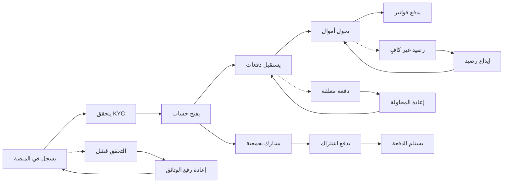

# JOURNEY MAP — BankMicro (SAAS-080)
> Owner: Journey Architect · Gate 1 · Persona: باسم (Small Business Owner)

## Flow (Mermaid)

## Stage Annotations
| Stage | User Action | Goal | Emotion | Friction | Screen |
|-------|-------------|------|---------|----------|--------|
| تسجيل | يملأ البيانات الأساسية | إنشاء حساب جديد | 😊 جاهز | يخاف من الاحتيال | Registration |
| KYC | يرفع صورة الهوية وصورة شخصية | التحقق من الهوية | 😐 مجهد | جودة الصورة منخفضة | KYC Upload |
| فتح حساب | اختيار نوع الحساب | بدء الخدمات البنكية | 😊 متحمس | خيارات متعددة مربكة | Account Open |
| استقبال دفعات | يشارك رقم الحساب مع العملاء | استلام المدفوعات | 😊 سعيد | العملاء يفضلون النقد | Receive Payment |
| تحويل | تحويل للموردين | دفع الموردين | 😊 سريع | عمولة تحويل عالية | Transfer |
| فواتير | دفع فواتير الكهرباء | تسديد الفواتير | 😐 ضروري | شركات الفواتير محدودة | Bill Pay |
| جمعية | المشاركة في جمعة ادخار | ادخار جماعي | 😊 اجتماعي | أحد الأعضاء يتأخر | Jameya |
| اشتراك | دفع القسط الشهري للجمعية | استمرار الادخار | 😊 ملتزم | تأكيد الدفع متأخر | Contribution |
| استلام | استلام مبلغ الجمعية | الحصول على المبلغ المقرر | 😊 فرحان | الضريبة على المبلغ | Payout |

## Ranked Friction Log
1. [High] التحقق من الهوية (KYC) يتطلب صور واضحة وكثير من المستخدمين لا يمتلكون كاميرا جيدة
2. [High] الأعضاء في الجمعية قد يتأخرون أو يتخلفون عن الدفع
3. [Med] رسوم التحويل الخارجي للبنوك الأخرى عالية نسبياً
4. [Med] بعض المستخدمين يخافون من استخدام تطبيق مالي (خوف من الاحتيال)
5. [Low] قائمة شركات الفاتورة محدودة في البداية
6. [Low] الإيداع عبر وكلاء قد يتأخر في الظهور في الحساب

**Rule:** Every later feature MUST trace to a stage above.
