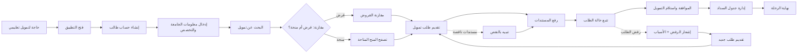

# JOURNEY MAP — EduFinance (SAAS-092)
> Owner: Journey Architect · Gate 1 · Persona: عمر الطالب

## التدفق (Mermaid)

## شروحات المراحل
| المرحلة | إجراء المستخدم | الهدف | المشاعر | الاحتكاك | الشاشة |
|---------|----------------|-------|---------|----------|--------|
| التسجيل | إنشاء حساب + إدخال بيانات | بدء الرحلة | 😊 سهل | معلومات كثيرة | Register |
| البحث عن تمويل | إدخال مبلغ + مدة + نوع | إيجاد خيارات مناسبة | 🤔 فضولي | قلة الخيارات المتاحة | LoanFinder |
| المقارنة | مقارنة عروض القروض والمنح | اختيار الأفضل | 😬 حائر | شروط معقدة | Compare |
| تقديم الطلب | ملء استمارة ورفع مستندات | التقديم رسمياً | 😰 قلق | خوف من رفض الطلب | Application |
| تتبع الحالة | متابعة تقدم الطلب | الاطمئنان | 😌 متفائل | تأخير في التحديث | Tracking |
| السداد | جدولة الدفعات الشهرية | الالتزام بالتمويل | 😊 مسيطر | صعوبة الدفع | Repayment |

## سجل الاحتكاك المرتب
1. [High] تعقيد إجراءات التقديم — تقليل الحقول + حفظ تلقائي
2. [High] نقص الشفافية في الشروط — مقارنة جانبية + حاسبة تكلفة
3. [Med] بطء معالجة الطلبات — إشعارات لحظية + تتبع في الوقت الحقيقي
4. [Med] صعوبة رفع المستندات — دعم جميع الصيغ + OCR
5. [Low] قلق من الرفض — إرشادات قبل التقديم + دعم
