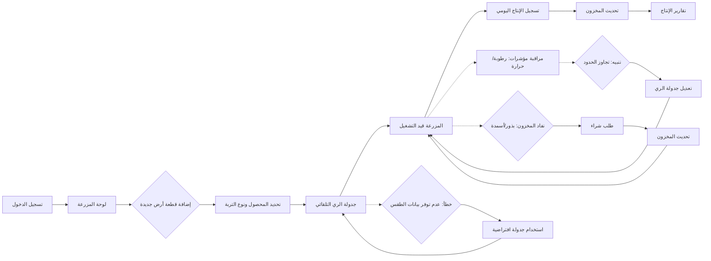

# JOURNEY MAP — FarmTech (SAAS-012)
> Owner: Journey Architect · Gate 1 · Persona: فهد القحطاني

## Flow (Mermaid)

## Stage Annotations
| Stage | User Action | Goal | Emotion | Friction | Screen |
|-------|-------------|------|---------|----------|--------|
| تسجيل الدخول | إدخال بيانات الدخول | الوصول إلى المنصة | محايدة | نسيان كلمة المرور | شاشة الدخول |
| لوحة المزرعة | عرض حالة الأراضي والمؤشرات | نظرة سريعة على المزرعة | إيجابية | كثرة الأراضي دون تصنيف | لوحة المزرعة الرئيسية |
| إضافة قطعة أرض | إدخال مساحة، نوع تربة، محصول | تسجيل قطعة جديدة | إيجابية | حقول تقنية كثيرة | نموذج أرض جديد |
| جدولة الري | اختيار المحصول، ضبط التكرار | أتمتة الري | إيجابية | صعوبة ضبط التكرار المناسب | معالج جدولة الري |
| تسجيل الإنتاج | إدخال كمية المحصول وتاريخه | توثيق الإنتاج | محايدة | إدخال يدوي مكرر | شاشة تسجيل الإنتاج |
| مراقبة المؤشرات | عرض قراءات الحساسات | كشف المشاكل مبكراً | إيجابية | عدم وجود حساسات فيزيائية | لوحة المراقبة |
| تقارير الإنتاج | تصدير تقرير شهري/سنوي | قياس الأداء | راضية | بيانات غير كافية لإنتاج تقارير دقيقة | شاشة التقارير |

## Ranked Friction Log
1. [High] صعوبة ضبط جدولة الري المناسبة لكل محصول
2. [High] إدخال الإنتاج اليومي يدوياً بدون توحيد وحدات القياس
3. [Med] عدم ربط بيانات الطقس الخارجية بجدولة الري
4. [Med] صعوبة تتبع المخزون (بذور، أسمدة، مبيدات)
5. [Low] ضعف واجهة المستخدم على الجوال في الحقل

**Rule:** Every later feature MUST trace to a stage above.
