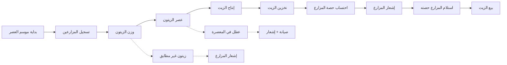
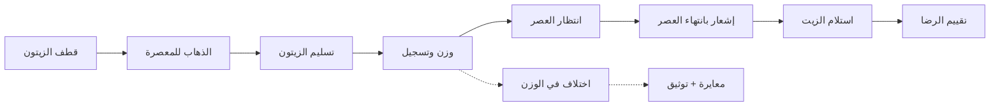

# JOURNEY MAP — OlivePress (SAAS-052)
> Owner: Journey Architect · Gate 1 · Persona: صاحب المعصرة الحاج منصور

## Flow — Olive Milling Season

## Flow — Farmer Journey

## Stage Annotations
| Stage | User Action | Goal | Emotion | Friction | Screen |
|-------|-------------|------|---------|----------|--------|
| بداية الموسم | فتح موسم جديد | تهيئة النظام للموسم | 😐 عادي | إعدادات التكوين | Season Dashboard |
| تسجيل مزارع | إدخال بيانات المزارع | توثيق المزارعين | 😊 سهل | بيانات ناقصة | Farmer Registration |
| وزن الزيتون | إدخال الوزن والجودة | تسجيل دقيق | 😐 عادي | دقة الميزان | Olive Intake |
| إنتاج الزيت | تسجيل كمية العصر | حساب الإنتاج | 🤔 مركز | تسجيل يدوي | Production Batch |
| حساب الحصة | تحديد نسبة المزارع | إنصاف المزارع | 😊 عادل | نزاعات النسبة | Farmer Share |
| بيع الزيت | تسجيل المبيع | تحقيق الإيراد | 😊 راضٍ | توثيق المشتري | Sales POS |

## Ranked Friction Log
1. [High] نزاعات حساب حصص المزارعين بسبب أخطاء يدوية — حل: حساب آلي، توثيق رقمي، تقارير شفافة
2. [High] ضعف الإنترنت في المناطق الريفية — حل: دعم أوفلاين كامل، مزامنة لاحقة عند الاتصال
3. [Med] صعوبة تتبع المزارعين والكميات — حل: بطاقات تعريف، QR code، قاعدة بيانات مركزية
4. [Med] ضياع السجلات بعد انتهاء الموسم — حل: أرشفة سحابية، نسخ احتياطي تلقائي
5. [Low] نقص معرفة المزارعين بحالتهم — حل: إشعارات واتساب/SMS، تطبيق مزارع

**Rule:** Every later feature MUST trace to a stage above.
