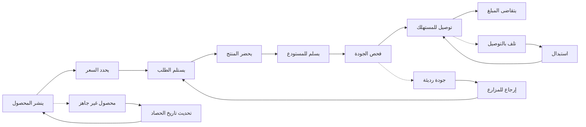

# JOURNEY MAP — SouqFarmer (SAAS-075)
> Owner: Journey Architect · Gate 1 · Persona: عبود (Farmer)

## Flow (Mermaid)

## Stage Annotations
| Stage | User Action | Goal | Emotion | Friction | Screen |
|-------|-------------|------|---------|----------|--------|
| نشر محصول | يصور المنتج ويكتب التفاصيل | عرض المحصول للبيع | 😊 متفائل | لا يجيد التصوير الجيد | Product Listing |
| تسعير | يحدد سعر الكيلو | سعر عادل ومنافس | 🤔 حائر | لا يعرف أسعار السوق | Pricing |
| استلام طلب | يتلقى إشعار بطلب جديد | تأكيد الطلب | 😊 سعيد | هاتف لا يدعم الإشعارات | Order Alert |
| تحضير | يقطف ويغلف المنتج | تجهيز الطلب للشحن | 😐 مجتهد | تغليف غير مناسب | Order Prep |
| تسليم | يوصل المنتج للمستودع | تسليم آمن | 😰 مجهد | تكلفة نقل إلى المستودع | Drop-off |
| فحص جودة | مفتش يفحص المنتج | ضمان الجودة | 😐 حاسم | خلاف على الجودة | Quality Check |
| توصيل | السائق يوصل للعميل | وصول سريع وآمن | 😊 إيجابي | العميل مش موجود | Delivery |
| تقاضي | استلام المبلغ في المحفظة | الحصول على ثمن البيع | 😊 فرحان | تأخير في الدفع | Payout |

## Ranked Friction Log
1. [High] المزارع لا يعرف سعر السوق العادل ليحدد سعر مناسب
2. [High] تكلفة النقل إلى المستودع تقلل هامش ربح المزارع
3. [Med] خلافات على جودة المنتج بين المفتش والمزارع
4. [Med] المزارعون يستخدمون هواتف ذكية ضعيفة مع إنترنت بطيء
5. [Low] العميل غير موجود عند التوصيل يضيع وقت السائق
6. [Low] المزارع لا يجيد تصوير المنتج بشكل احترافي

**Rule:** Every later feature MUST trace to a stage above.
