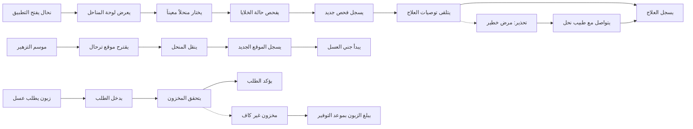

# JOURNEY MAP — HoneyFarm (SAAS-082)
> Owner: Journey Architect · Gate 1 · Persona: أبو محمد العنزي

## Flow (Mermaid)

## Stage Annotations
| Stage | User Action | Goal | Emotion | Friction | Screen |
|-------|-------------|------|---------|----------|--------|
| فحص الخلايا | تسجيل حالة الخلية بالصور | كشف الأمراض مبكراً | 😐 مجتهد → 😊 مطمئن | الحقول النائية لا يوجد إنترنت | Inspection Form |
| تسجيل قطف | إدخال وزن العسل المستخرج | توثيق الإنتاج | 😊 راضٍ | مقياس الوزن قد لا يكون دقيقاً | Harvest Entry |
| ترحال المنحل | تسجيل الموقع الجديد | متابعة التزهير | 😐 مجهد | ضعف التغطية في المناطق البعيدة | Apiary Map |
| طلب شراء | اختيار المنتج والكمية | شراء العسل بسهولة | 😊 متحمس | تكلفة الشحن عالية | Product Store |
| معالجة مرض | تسجيل العلاج والجرعة | إنقاذ الخلية | 😟 قلق | الجرعات تحتاج حساب دقيق | Treatment Log |

## Ranked Friction Log
1. [High] لا يوجد إنترنت في معظم المناحل — يحتاج وضع أوفلاين كامل
2. [High] صعوبة تقدير مواعيد التزهير والتخطيط للترحال
3. [Med] النحالون يفضلون الدفاتر الورقية — مقاومة رقمية
4. [Med] حساب الجرعات الدقيقة للعلاج (حسب حجم الخلية)
5. [Low] توصيل المنتجات للعملاء في المناطق النائية

**Rule:** Every later feature MUST trace to a stage above.
