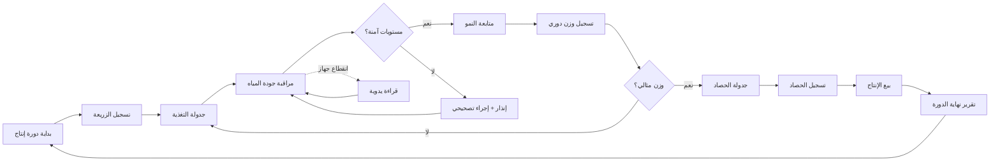

# JOURNEY MAP — FishFarm (SAAS-097)
> Owner: Journey Architect · Gate 1 · Persona: يوسف مالك المزرعة

## التدفق (Mermaid)

## شروحات المراحل
| المرحلة | إجراء المستخدم | الهدف | المشاعر | الاحتكاك | الشاشة |
|---------|----------------|-------|---------|----------|--------|
| تسجيل الزريعة | إدخال نوع + عدد + تاريخ | بدء الدورة | 😊 متفائل | أخطاء في الإدخال | FryRegistration |
| التغذية | جدولة نوع العلف وكميته | تغذية مثالية | 🤔 منظم | حسابات يدوية | FeedingSchedule |
| المراقبة | متابعة حرارة/أكسجين/pH | صحة الأسماك | 😰 قلق | أجهزة غير متصلة | WaterQuality |
| النمو | وزن عينات + تسجيل | تتبع النمو | 📊 دقيق | صعوبة أخذ العينات | GrowthTracking |
| الحصاد | جدولة + تنفيذ | جني الإنتاج | 😊 فخور | تنسيق العمالة | Harvest |
| البيع | تسجيل المشتري + السعر | تسييل الإنتاج | 😌 راضٍ | تقلبات الأسعار | Sales |

## سجل الاحتكاك المرتب
1. [High] نقص مراقبة جودة المياه — IoT مستشعرات + إنذار فوري
2. [High] هدر العلف — حاسبة FCR أوتوماتيكية
3. [Med] صعوبة تتبع النمو — جدول وزن + رسوم بيانية
4. [Med] تأخير الحصاد — تنبيه بالوزن المثالي
5. [Low] توثيق يدوي — إدخال سريع عبر الموبايل
