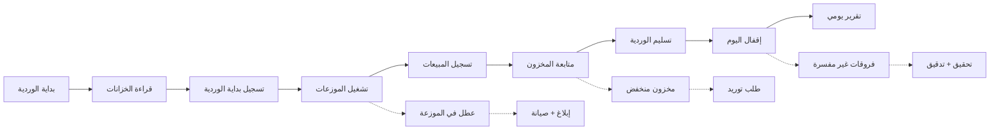

# JOURNEY MAP — GasStation (SAAS-055)
> Owner: Journey Architect · Gate 1 · Persona: مدير المحطة خالد

## Flow — Daily Operations

## Flow — Supply Chain

## Stage Annotations
| Stage | User Action | Goal | Emotion | Friction | Screen |
|-------|-------------|------|---------|----------|--------|
| فتح الوردية | تسجيل بداية الدوام | ضبط الافتتاحية | 😐 عادي | نسيان الرصيد الافتتاحي | Shift Open |
| مراقبة المخزون | قراءة الخزانات | معرفة المستوى | 🤔 مركز | دقة القراءة | Tank Levels |
| تسجيل المبيعات | إدخال المبيعات | توثيق الإيراد | 😐 عادي | بطء الإدخال | Sales Entry |
| إقفال الوردية | تسوية الحسابات | إغلاق دقيق | 😟 متوتر | فروقات غير متوقعة | Shift Close |
| طلب التوريد | إصدار أمر توريد | تجديد المخزون | 😐 عادي | تأخير الموزع | Purchase Order |
| التقارير | تصدير التقارير | تحليل الأداء | 😊 راضٍ | تقارير غير دقيقة | Reports |

## Ranked Friction Log
1. [High] نقص دقة قراءة مستويات الخزانات — حل: دمج حساسات مستوى، قراءة يدوية كبديل
2. [High] صعوبة اكتشاف الفاقد والسرقات — حل: تسوية يومية، تقارير فرق، إنذارات
3. [Med] تغيير أسعار الوقود بدون نظام — حل: تحديث أسعار فوري، موافقة قبل النشر
4. [Med] كثرة الفروقات عند إقفال الوردية — حل: إجراءات إقفال موحدة، تدقيق تلقائي
5. [Low] عدم وجود تقارير مقارنة بين المحطات — حل: لوحة سلاسل، مقارنة أداء

**Rule:** Every later feature MUST trace to a stage above.
