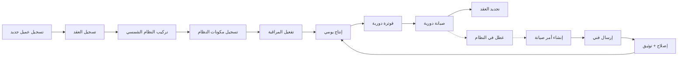
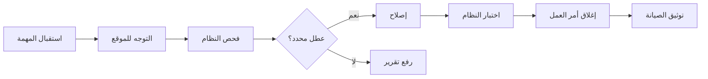

# JOURNEY MAP — SolarPro (SAAS-057)
> Owner: Journey Architect · Gate 1 · Persona: مدير الشركة مازن

## Flow — Solar System Lifecycle

## Flow — Technician Work Order

## Stage Annotations
| Stage | User Action | Goal | Emotion | Friction | Screen |
|-------|-------------|------|---------|----------|--------|
| تسجيل عميل | إدخال بيانات | توثيق العميل | 😐 عادي | بيانات ناقصة | Customer Form |
| تركيب النظام | تسجيل المكونات | توثيق التثبيت | 😊 راضٍ | أخطاء في المكونات | Installation |
| مراقبة الإنتاج | متابعة الأداء | ضمان الإنتاجية | 🤔 مراقب | بيانات غير دقيقة | Production Dashboard |
| الصيانة | جدولة وإرسال | استمرارية التشغيل | 😐 عادي | عدم التزام العميل | Maintenance |
| الفوترة | إصدار الفاتورة | تحصيل الإيراد | 😊 راضٍ | تأخير الدفع | Invoices |
| تقارير ROI | تحليل العائد | إثبات القيمة | 😊 فخور | حسابات معقدة | ROI Reports |

## Ranked Friction Log
1. [High] تكامل API العواكس معقد ويختلف بين المصنعين — حل: طبقة تجريد API، دعم عاكسين أولاً
2. [High] عدم متابعة الصيانة الدورية — حل: جدول صيانة آلي، تذكير تلقائي، تقارير
3. [Med] صعوبة حساب أداء النظام وإثبات العائد للعميل — حل: لوحة عميل، توفير بالريال، تقارير ROI
4. [Med] ضياع عقود الصيانة وعدم تجديدها — حل: إدارة عقود، تذكير بالتجديد، تجديد تلقائي
5. [Low] تسجيل الأعطال يدوياً — حل: تطبيق فني، قوائم فحص، رفع صور

**Rule:** Every later feature MUST trace to a stage above.
