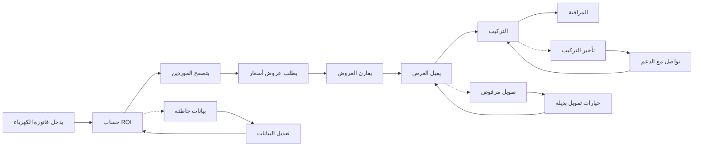

# JOURNEY MAP — RooftopSolar (SAAS-072)
> Owner: Journey Architect · Gate 1 · Persona: خالد (Homeowner)

## Flow (Mermaid)

## Stage Annotations
| Stage | User Action | Goal | Emotion | Friction | Screen |
|-------|-------------|------|---------|----------|--------|
| إدخال بيانات | يدخل فاتورة الكهرباء وعنوان المنزل | حساب دقيق للتوفير | 😊 متفائل | لا يعرف رقم الحساب | Assessment Form |
| حساب ROI | يقرأ تقرير التوفير السنوي وفترة الاسترداد | معرفة الجدوى الاقتصادية | 😯 مندهش | أرقام متفائلة جداً | ROI Report |
| تصفح | يقرأ ملفات الموردين | اختيار مورد موثوق | 🤔 حذر | تقييمات قليلة | Installer List |
| طلب عروض | يرسل طلب عروض لعدة موردين | الحصول على أفضل سعر | 😊 جيد | بعض الموردين لا يردون | Quote Request |
| مقارنة | يقارن السعر والمواصفات والضمان | اختيار أفضل عرض | 🤔 مركز | مقارنة صعبة بدون جدول | Quote Compare |
| قبول | يوافق على العرض ويدفع العربون | بدء التركيب | 😊 سعيد | الدفع غير آمن | Payment Page |
| تركيب | المورد يركب الألواح | تشغيل النظام الشمسي | 😐 متابع | تأخير في المواعيد | Installation Tracker |
| مراقبة | يتفقد إنتاج الطاقة | التأكد من التوفير الفعلي | 😊 مطمئن | لوحة التحكم معقدة | Monitoring Dashboard |

## Ranked Friction Log
1. [High] المستخدم لا يعرف رقم حساب الكهرباء أو بيانات الفاتورة بالضبط
2. [High] حاسبة ROI تعطي أرقاماً متفائلة لا تتحقق على أرض الواقع
3. [Med] بعض الموردين لا يردون على طلبات العروض
4. [Med] عملية المقارنة صعبة بدون جدول مقارنة واضح
5. [Low] لوحة مراقبة الإنتاج معقدة للمستخدم العادي
6. [Low] فترة الاسترداد المحسوبة لا تشمل تكاليف الصيانة

**Rule:** Every later feature MUST trace to a stage above.
