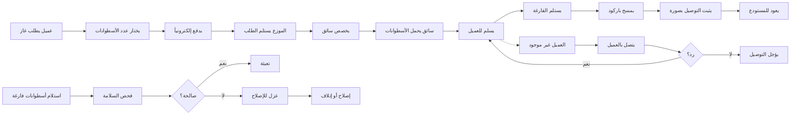

# JOURNEY MAP — GasDistribute (SAAS-085)
> Owner: Journey Architect · Gate 1 · Persona: أبو سعد العمري

## Flow (Mermaid)

## Stage Annotations
| Stage | User Action | Goal | Emotion | Friction | Screen |
|-------|-------------|------|---------|----------|--------|
| طلب غاز | اختيار الكمية والدفع | طلب سريع | 😊 سهل | قد يكون الدفع الإلكتروني غير مألوف | Customer Order |
| تخصيص سائق | تعيين سائق للطلب | توزيع المهام | 😐 منظم | السائقون مشغولون | Assign Driver |
| تحميل الأسطوانات | مسح باركود الخروج | تتبع المخزون | 😐 دقيق | وقت التحميل يطول | Cylinder Scan |
| توصيل | تسليم واستلام فارغة | إتمام التوصيل | 😟 متوتر | العميل غير موجود | Delivery |
| إثبات التوصيل | تصوير الاستلام | توثيق | 😊 مطمئن | صعوبة التصوير في الإضاءة الضعيفة | Proof Photo |
| فحص أسطوانة | فحص السلامة | ضمان السلامة | 😐 جاد | الفحص اليدوي يحتاج وقت | Inspection |

## Ranked Friction Log
1. [High] الأسطوانات تضيع بدون تتبع — خسارة مالية مباشرة
2. [High] العملاء يطلبون عبر الهاتف — أخطاء في العنوان والعدد
3. [High] تحصيل المدفوعات — ديون متراكمة
4. [Med] السائق لا يستطيع إثبات التوصيل
5. [Med] تأخير فحص الأسطوانات الدوري — مخاطر سلامة

**Rule:** Every later feature MUST trace to a stage above.
