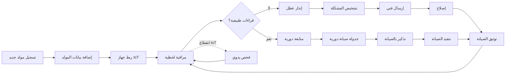

# JOURNEY MAP — PowerBackup (SAAS-099)
> Owner: Journey Architect · Gate 1 · Persona: سلطان مسئول الصيانة

## التدفق (Mermaid)

## شروحات المراحل
| المرحلة | إجراء المستخدم | الهدف | المشاعر | الاحتكاك | الشاشة |
|---------|----------------|-------|---------|----------|--------|
| التسجيل | إضافة مولد + مواصفاته | قاعدة بيانات | 😊 منظم | معلومات كثيرة | GeneratorRegistration |
| المراقبة | لوحة تحكم + قراءات حية | طمأنينة | 😌 مطمئن | أجهزة غير متصلة | Monitoring |
| الإنذار | تنبيه بعطل أو قراءة غير طبيعية | استباق المشاكل | 😰 قلق | إنذارات كاذبة | Alerts |
| الصيانة | جدولة + تنفيذ | إصلاح/وقاية | 🔧 عملي | تنسيق الفنيين | Maintenance |
| الوقود | متابعة مستوى + تعبئة | تشغيل مستمر | ⛽ منظم | تأخير التعبئة | FuelManagement |
| التقارير | تقارير أداء + صيانة | تحليل | 📊 دقيق | تقارير يدوية | Reports |

## سجل الاحتكاك المرتب
1. [High] أعطال مفاجئة — IoT إنذار مبكر + تشخيص تلقائي
2. [High] نفاد وقود مفاجئ — مستشعر مستوى وقود + طلب تلقائي
3. [Med] تفويت صيانة دورية — تقويم + تذكير
4. [Med] صعوبة إيجاد فني — شبكة فنيين + تقييمات
5. [Low] توثيق الصيانة — سجل تلقائي مع صور
