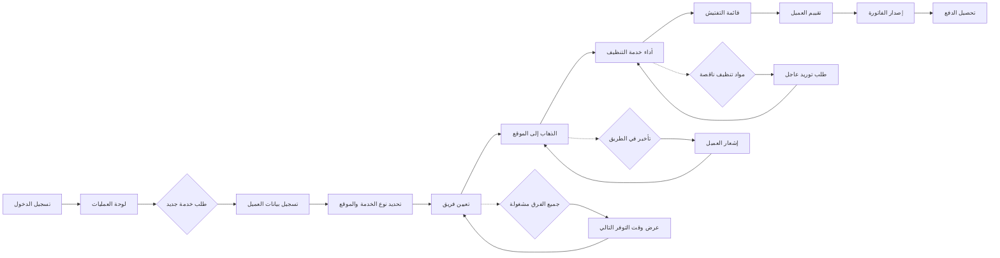

# JOURNEY MAP — CleanPro (SAAS-020)
> Owner: Journey Architect · Gate 1 · Persona: بدر العجمي

## Flow (Mermaid)

## Stage Annotations
| Stage | User Action | Goal | Emotion | Friction | Screen |
|-------|-------------|------|---------|----------|--------|
| لوحة العمليات | عرض الطلبات النشطة ومواقع الفرق | نظرة على العمليات | إيجابية | كثرة المعلومات | شاشة لوحة التحكم |
| طلب خدمة | تسجيل بيانات العميل والخدمة | إنشاء طلب | محايدة | تكرار إدخال بيانات العملاء | نموذج طلب |
| تعيين فريق | اختيار الفريق المتاح الأقرب | بدء الخدمة | إيجابية | عدم توفر فرق كافية | شاشة التعيين |
| الذهاب إلى الموقع | توجيه الفريق باستخدام GPS | الوصول في الوقت المحدد | محايدة | زحمة المرور | شاشة التوجيه |
| أداء الخدمة | تنفيذ مهام التنظيف حسب القائمة | إكمال الخدمة | إيجابية | صعوبة متابعة المهام بدون قائمة | شاشة المهام |
| تقييم العميل | جمع تقييم وتعليق | قياس الجودة | محايدة | عدم رغبة العميل بالتقييم | شاشة التقييم |
| الدفع والفاتورة | إصدار فاتورة وتحصيل | إتمام المعاملة | راضية | تأخير الدفع | شاشة الفوترة |

## Ranked Friction Log
1. [High] عدم معرفة موقع الفرق في الوقت الفعلي
2. [High] تفاوت جودة التنظيف بين فريق وآخر
3. [Med] نقص مواد التنظيف في بداية الخدمة
4. [Med] تأخير العملاء في الدفع بعد الخدمة
5. [Low] صعوبة إعداد عقود الصيانة الشهرية

**Rule:** Every later feature MUST trace to a stage above.
