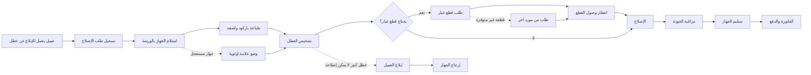

# JOURNEY MAP — RepairPro (SAAS-070)
> Owner: Journey Architect · Gate 1 · Persona: عمار — مدير ورشة

## Flow (Mermaid)

## Stage Annotations
| Stage | User Action | Goal | Emotion | Friction | Screen |
|-------|-------------|------|---------|----------|--------|
| الإبلاغ عن العطل | مكالمة هاتفية | تسجيل المشكلة | 😓 منزعج (العميل) | انتظار الرد، وصف المشكلة صعب | Customer Request |
| استلام الجهاز | تسجيل الجهاز وطباعة باركود | توثيق الاستلام | 😐 محايد | إدخال بيانات الجهاز يدوياً | Receive Device |
| التشخيص | فحص الجهاز وتحديد العطل | معرفة السبب | 🤔 مركز | أجهزة غير مألوفة، نقص خبرة | Diagnosis |
| الإصلاح | تفكيك وإصلاح وتركيب | إصلاح ناجح | 😌 واثق | قطع الغيار قد لا تناسب | Repair Log |
| مراقبة الجودة | اختبار الجهاز بعد الإصلاح | ضمان جودة الإصلاح | 😐 محايد | لا توجد قائمة فحص موحدة | QC |
| التسليم | العميل يستلم الجهاز | إغلاق الطلب | 😊 العميل راضٍ | الدفع قد يتأخر | Delivery |
| الفاتورة | إصدار واستلام المبلغ | تحصيل الإيراد | 😐 محايد | الفاتورة اليدوية تاخذ وقتاً | Invoice |

## Ranked Friction Log
1. [High] العملاء يتصلون للسؤال عن حالة أجهزتهم — 20+ مكالمة يومياً
2. [High] أجهزة مفقودة في الورشة — 5% من الأجهزة تتأخر بسبب سوء التنظيم
3. [High] قطع الغيار تنفد بشكل مفاجئ — توقف العمل 1-2 يوم شهرياً
4. [Med] توزيع المهام على الفنيين — محسوبيات وخلافات
5. [Med] توثيق الإصلاح — نزاعات مع العملاء حول ما تم إصلاحه
6. [Low] الفواتير — أخطاء في الحساب اليدوي

**Rule:** Every later feature MUST trace to a stage above.
