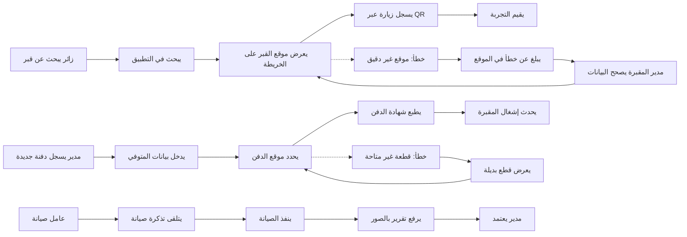

# JOURNEY MAP — CemeteryMgt (SAAS-081)
> Owner: Journey Architect · Gate 1 · Persona: أحمد الغامدي

## Flow (Mermaid)

## Stage Annotations
| Stage | User Action | Goal | Emotion | Friction | Screen |
|-------|-------------|------|---------|----------|--------|
| بحث عن قبر | الزائر يدخل اسم المتوفي | إيجاد القبر بسرعة | 😟 قلق → 😊 ارتياح | البحث يحتاج تهجئة دقيقة | Grave Locator |
| عرض الموقع | مشاهدة الخريطة مع导航 GPS | الوصول للقبر | 😊 راضٍ | GPS قد لا يكون دقيقاً في المقابر القديمة | Map View |
| تسجيل زيارة | مسح QR عند القبر | توثيق الزيارة | 😐 محايد | قد ينسى الزائر المسح | QR Scanner |
| تسجيل دفنة | إدخال بيانات المتوفي والقطعة | توثيق الدفن إلكترونياً | 😟 قلق (حساسية الموقف) | بيانات ورقية غير مقروءة | Burial Record |
| طباعة شهادة | ضغط زر لطباعة الشهادة | إصدار وثيقة رسمية | 😊 راضٍ | تحتاج تنسيق مطابق للنماذج البلدية | Certificate |
| تذكرة صيانة | استلام مهمة تصليح | إصلاح العطل | 😐 محايد | صعوبة تصوير العطل | Maintenance |

## Ranked Friction Log
1. [High] دقة GPS في المقابر القديمة ذات التخطيط غير المنتظم
2. [High] صعوبة قراءة سجلات الدفن الورقية القديمة (بخط اليد)
3. [Med] الزوار لا يعرفون استخدام QR code
4. [Med] حساسية أسر المتوفين عند التعامل مع البيانات
5. [Low] تكامل نظام إصدار الشهادات مع الأنظمة البلدية

**Rule:** Every later feature MUST trace to a stage above.
