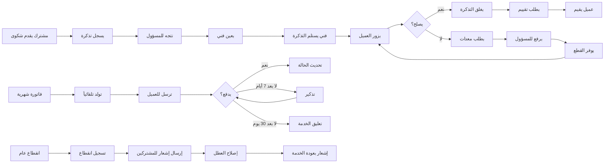

# JOURNEY MAP — CableTV (SAAS-086)
> Owner: Journey Architect · Gate 1 · Persona: سامي الراجحي

## Flow (Mermaid)

## Stage Annotations
| Stage | User Action | Goal | Emotion | Friction | Screen |
|-------|-------------|------|---------|----------|--------|
| شكوى |填写 نموذج الشكوى | حل المشكلة | 😟 غاضب → 😊 مرتاح | يريد حلاً فورياً | New Ticket |
| تعيين فني | اختيار فني متاح | توزيع المهام | 😐 منظم | قد لا يتوفر فني | Assign |
| زيارة فني | الذهاب للعميل | الإصلاح | 😟 ضغط | قطع الغيار قد لا تكون متوفرة | Tech Visit |
| إصدار فاتورة | توليد الفواتير الشهرية | تحصيل المدفوعات | 😐 روتيني | الفواتير المقطوعة تحتاج حساب | Invoice |
| انقطاع عام | تسجيل وإبلاغ | إعلام المشتركين | 😟 أزمة | ضغط المكالمات | Outage |

## Ranked Friction Log
1. [High] وقت استجابة الشكاوى طويل — العملاء يغضبون
2. [High] الفواتير المتأخرة تتراكم — خسارة إيرادات
3. [Med] الفنيون لا يبلغون عن إنجاز المهام
4. [Med] لا يوجد تتبع لمعدات CPE (أجهزة تستبدل ولا تسجل)
5. [Low] العملاء لا يعرفون موعد وصول الفني

**Rule:** Every later feature MUST trace to a stage above.
