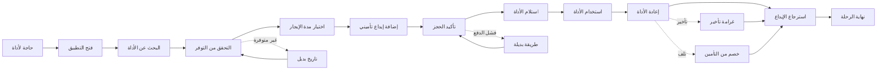

# JOURNEY MAP — ToolRental (SAAS-094)
> Owner: Journey Architect · Gate 1 · Persona: سامي المقاول

## التدفق (Mermaid)

## شروحات المراحل
| المرحلة | إجراء المستخدم | الهدف | المشاعر | الاحتكاك | الشاشة |
|---------|----------------|-------|---------|----------|--------|
| البحث | تصفح + بحث عن أداة | إيجاد الأداة المناسبة | 😊 سريع | تصنيف غير واضح | SearchBrowse |
| التوفر | التحقق من تاريخ ومدة | تأكيد توفر الأداة | 🤔 متحفظ | توفر غير دقيق | Availability |
| الدفع | دفع الإيجار + الإيداع | تأمين الحجز | 😬 حذر | إيداع كبير | Checkout |
| الاستلام | استلام الأداة من المحل | بدء الاستخدام | 😊 راضٍ | ازدحام | Pickup |
| الإعادة | إعادة الأداة + الفحص | إنهاء الإيجار | 😰 قلق من التلف | فحص متحيز | Return |
| الإيداع | استرجاع الإيداع | استكمال الدورة | 😊 مرتاح | تأخير الاسترجاع | Refund |

## سجل الاحتكاك المرتب
1. [High] عدم دقة التوفر — مخزون لحظي + تحديث فوري
2. [High] قلق من التلف عند الإعادة — معايير فحص واضحة + صور قبل/بعد
3. [Med] إيداع تأميني كبير — خيارات إيداع مرنة
4. [Med] تأخير استلام/إعادة — جدولة ذكية للمواعيد
5. [Low] صعوبة التصنيف — بحث ذكي + فئات واضحة
