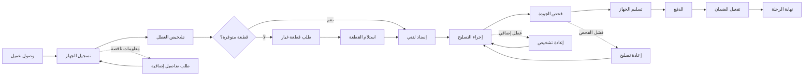

# JOURNEY MAP — MobileFix (SAAS-095)
> Owner: Journey Architect · Gate 1 · Persona: أحمد صاحب الورشة

## التدفق (Mermaid)

## شروحات المراحل
| المرحلة | إجراء المستخدم | الهدف | المشاعر | الاحتكاك | الشاشة |
|---------|----------------|-------|---------|----------|--------|
| التسجيل | إدخال بيانات العميل والجهاز | تسجيل الدخول | 😊 سريع | معلومات كثيرة | Intake |
| التشخيص | تحديد العطل وقطعة الغيار | تشخيص دقيق | 🤔 مركز | أجهزة غير مألوفة | Diagnosis |
| الإسناد | توزيع على الفنيين | توزيع عادل | 😌 منظم | تفاوت المهارات | Assignment |
| التصليح | إجراء الإصلاح | إصلاح العطل | 🔧 مجتهد | أعطال معقدة | Repair |
| الفحص | التحقق من جودة التصليح | ضمان الجودة | ✅ دقيق | أجهزة متعددة | QC |
| التسليم | تسليم الجهاز + الدفع | إنهاء المعاملة | 😊 راضٍ | خلاف على السعر | Delivery |

## سجل الاحتكاك المرتب
1. [High] فوضى استقبال الأجهزة — استقبال رقمي سريع
2. [High] نقص قطع الغيار — مخزون + تنبيهات + تكامل موردين
3. [Med] صعوبة تتبع التصليحات — لوحة تحكم لكل فني
4. [Med] خلاف على الأسعار — قائمة أسعار شفافة + تقدير مسبق
5. [Low] عدم توثيق الضمان — إشعار تلقائي بانتهاء الضمان
