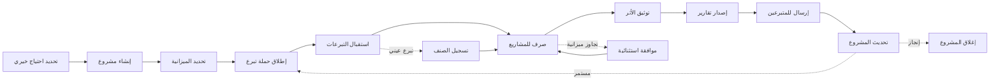

# JOURNEY MAP — NGOmgt (SAAS-096)
> Owner: Journey Architect · Gate 1 · Persona: عبدالله مدير الجمعية

## التدفق (Mermaid)

## شروحات المراحل
| المرحلة | إجراء المستخدم | الهدف | المشاعر | الاحتكاك | الشاشة |
|---------|----------------|-------|---------|----------|--------|
| إنشاء مشروع | تحديد اسم + هدف + ميزانية | بدء العمل الخيري | 😊 متفائل | تفاصيل كثيرة | ProjectCreate |
| حملة التبرع | إطلاق حملة + استهداف متبرعين | جمع التبرعات | 🤔 متحمس | الوصول للمتبرعين | Campaign |
| استقبال التبرع | تسجيل التبرعات + إيصالات | توثيق التبرعات | 😌 منظم | أخطاء في التسجيل | Donation |
| الصرف | صرف المبالغ للمستحقين | تنفيذ المشروع | 😰 قلق | توثيق الصرف | Disbursement |
| توثيق الأثر | صور + قصص + أرقام | إثبات الأثر | 😊 فخور | صعوبة التوثيق | Impact |
| التقارير | تقارير مالية + إحصاءات | شفافية | ✅ دقيق | تقارير يدوية | Reports |

## سجل الاحتكاك المرتب
1. [High] ضعف الشفافية — تقارير آلية + توثيق أثر
2. [High] صعوبة إدارة المتبرعين — CRM + أتمتة
3. [Med] توثيق الصرف الميداني — تطبيق موبايل + صور + GPS
4. [Med] متابعة المتطوعين — جدولة ذكية + تواصل
5. [Low] تكرار إدخال البيانات — تكامل مع منصات الدفع
