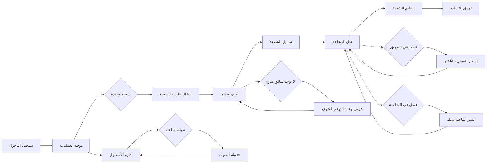

# JOURNEY MAP — CargoNet (SAAS-017)
> Owner: Journey Architect · Gate 1 · Persona: فيصل الشهراني

## Flow (Mermaid)

## Stage Annotations
| Stage | User Action | Goal | Emotion | Friction | Screen |
|-------|-------------|------|---------|----------|--------|
| لوحة العمليات | عرض الشحنات النشطة وموقع السائقين | نظرة على كفاءة العمليات | إيجابية | كثرة التنبيهات المتزامنة | لوحة التحكم |
| شحنة جديدة | إدخال العميل والمصدر والوجهة | تسجيل الشحنة | محايدة | معلومات ناقصة من العميل | نموذج شحنة |
| تعيين سائق | اختيار السائق الأنسب للمسافة | بدء التوصيل | إيجابية | تداخل جداول السائقين | شاشة التعيين |
| تحميل الشحنة | تاكيد استلام البضاعة بالصور | توثيق الاستلام | محايدة | وقت تحميل طويل | شاشة التحميل |
| نقل البضاعة | تتبع موقع الشاحنة لحظياً | ضمان سير الشحنة | إيجابية | ضعف التغطية في المناطق النائية | خريطة التتبع |
| تسليم الشحنة | توقيع العميل والتقاط صور | إتمام التسليم | إيجابية | عنوان غير دقيق للعميل | شاشة التسليم |
| توثيق التسليم | رفع الإثباتات والنظام | إغلاق الشحنة | راضية | صور غير واضحة | شاشة التوثيق |

## Ranked Friction Log
1. [High] تعيين سائق غير قريب من موقع الشحنة يؤدي لتأخير
2. [High] أعطال مفاجئة بسبب تأجيل الصيانة الدورية
3. [Med] صعوبة تواصل العميل مع السائق مباشرة
4. [Med] عدم وضوح عنوان التسليم للسائق
5. [Low] تأخير في استلام إثباتات التسليم من السائقين

**Rule:** Every later feature MUST trace to a stage above.
