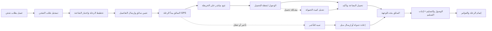

# JOURNEY MAP — TruckNet (SAAS-063)
> Owner: Journey Architect · Gate 1 · Persona: خالد — مدير أسطول

## Flow (Mermaid)

## Stage Annotations
| Stage | User Action | Goal | Emotion | Friction | Screen |
|-------|-------------|------|---------|----------|--------|
| طلب شحن | استقبال طلب العميل | تسجيل التفاصيل | 😐 محايد | إدخال بيانات متكرر | Order Entry |
| تخطيط الرحلة | اختيار شاحنة + سائق + مسار | توزيع مثالي | 🤔 مركز | لا تظهر حمولة الشاحنات الحالية | Trip Planner |
| توجيه السائق | إرسال تفاصيل الرحلة للسائق | انطلاق سريع | 😊 مرتاح | السائق لا يقرأ التعليمات أحياناً | Dispatch |
| بدء الرحلة | السائق يضغط "بدأت" | تفعيل التتبع | 😌 منطلق | GPS قد لا يعمل في المناطق النائية | Driver App |
| تتبع مباشر | مراقبة الشاحنات على الخريطة | رؤية كاملة | 😊 مرتاح | الخريطة تستهلك بيانات كثيرة | Live Map |
| التسليم | تأكيد الوصول + صورة التوقيع | توثيق كامل | 😃 منجز | التصوير قد لا يلتقط清晰 | POD Capture |
| إتمام الرحلة | إغلاق الرحلة والفواتير | إنهاء سلس | 😌 راضٍ | الفاتورة تحتاج بيانات إضافية | Trip Completion |

## Ranked Friction Log
1. [High] تحديد موقع الشاحنات — كل رحلة تحتاج 2-3 مكالمات هاتفية
2. [High] جدولة الرحلات يدوياً — 45 دقيقة يومياً في التوزيع
3. [Med] إثبات التسليم ورقياً — يضيع أحياناً، الخلافات مع العملاء
4. [Med] العملاء يتصلون للسؤال عن موقع الشحنة — يشتت المنسقة
5. [Low] توثيق السائقين — صلاحية الرخص تنتهي بدون تنبيه
6. [Low] تقارير استهلاك الوقود — لا توجد رؤية لتحسين التكاليف

**Rule:** Every later feature MUST trace to a stage above.
