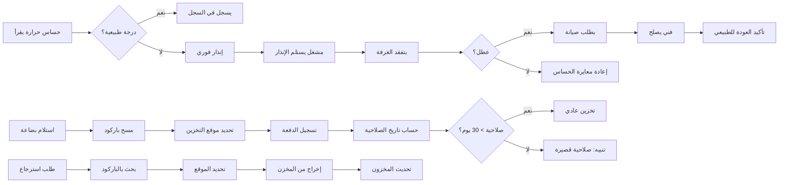

# JOURNEY MAP — ColdStorage (SAAS-087)
> Owner: Journey Architect · Gate 1 · Persona: عبدالله الغامدي

## Flow (Mermaid)

## Stage Annotations
| Stage | User Action | Goal | Emotion | Friction | Screen |
|-------|-------------|------|---------|----------|--------|
| مراقبة حرارة | متابعة قراءات الحساسات | ضمان استمرارية التبريد | 😊 مطمئن | الحساسات قد تتعطل | Temp Dashboard |
| إنذار حرارة | استلام إشعار الانحراف | استجابة سريعة | 😟 قلق | قد لا يسمع المنبه | Alert |
| استلام بضاعة | مسح الباركود والتخزين | تسجيل المخزون | 😐 مجهد | البضاعة كبيرة والوقت ضيق | Stock Receipt |
| تتبع صلاحية | مراجعة تواريخ انتهاء الصلاحية | تقليل الفاقد | 😐 منظم | بعض المنتجات بدون تاريخ واضح | Expiry Dashboard |
| استرجاع بضاعة | إخراج المنتجات للعميل | خدمة العميل | 😊 راضٍ | صعوبة إيجاد الموقع بسرعة | Stock Dispatch |

## Ranked Friction Log
1. [High] أعطال التبريد تكتشف بعد فوات الأوان — تلف المنتجات
2. [High] انتهاء صلاحية المنتجات دون اكتشاف — فاقد كبير
3. [Med] صعوبة تحديد موقع البضاعة داخل المستودع
4. [Med] الحساسات تحتاج معايرة دورية
5. [Low] استلام البضاعة يستغرق وقتاً طويلاً بالتسجيل اليدوي

**Rule:** Every later feature MUST trace to a stage above.
