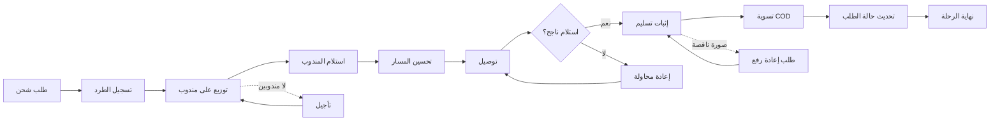

# JOURNEY MAP — CourierMgt (SAAS-098)
> Owner: Journey Architect · Gate 1 · Persona: خليل مدير التوصيل

## التدفق (Mermaid)

## شروحات المراحل
| المرحلة | إجراء المستخدم | الهدف | المشاعر | الاحتكاك | الشاشة |
|---------|----------------|-------|---------|----------|--------|
| التسجيل | إدخال بيانات الطرد | تسليم صحيح | 😊 سريع | معلومات ناقصة | ParcelRegistration |
| التوزيع | تعيين مندوب + مسار | توزيع عادل | 🤔 مدبر | توفر المندوبين | Dispatch |
| التوصيل | تنفيذ المسار | إيصال الطرد | 🚚 مجتهد | زحمة مرور | Delivery |
| الإثبات | صورة + توقيع | توثيق التسليم | ✅ دقيق | اتصال ضعيف | ProofOfDelivery |
| التسوية | تسجيل COD | إدارة المدفوعات | 💰 دقيق | أخطاء حسابية | Settlement |
| التحديث | إعلام العميل | رضا العميل | 📱 أوتوماتيكي | تأخر الإشعارات | StatusUpdate |

## سجل الاحتكاك المرتب
1. [High] ضعف تتبع المندوبين — GPS حي + خريطة
2. [High] أخطاء COD — تسوية رقمية + محفظة مندوب
3. [Med] إثبات تسليم ضعيف — صورة + توقيع إلكتروني + GPS location
4. [Med] تحسين المسار — خوارزمية مسار ذكية
5. [Low] تأخر إشعارات العملاء — Webhook + SMS + تطبيق
