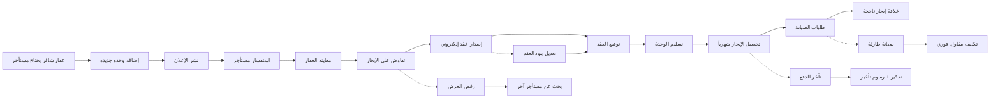

# JOURNEY MAP — RentTrack (SAAS-004)
> Owner: Journey Architect · Gate 1 · Persona: عبدالله — مالك عقارات

## المسار (Mermaid)

## تعليقات المراحل
| المرحلة | إجراء المستخدم | الهدف | المشاعر | الاحتكاك | الشاشة |
|----------|----------------|-------|---------|----------|--------|
| إضافة وحدة | يدخل بيانات العقار والصور | نشر الوحدة | 🙂 راض | إدخال تفاصيل كثيرة | Add Property |
| إصدار عقد | يختار قالب العقد ويملأ البيانات | توثيق الإيجار قانونياً | 😊 واثق | صياغة البنود القانونية | Contract Builder |
| تحصيل إيجار | النظام يرسل فاتورة شهرية | استلام الدفعة | 😊 منتظم | رفض الدفع الإلكتروني | Payment |
| صيانة | مستأجر يرفع طلب صيانة | إصلاح العطل | 😐 محايد | تأخر الاستجابة | Maintenance |

## سجل الاحتكاك المرتب
1. [High] تأخر المستأجرين في الدفع → حل: تذكير آلي + تحصيل إلكتروني (Screen 3)
2. [High] صعوبة تتبع طلبات الصيانة → حل: منصة تتبع بالصور والحالة (Screen 4)
3. [Med] نسيان تواريخ انتهاء العقود → حل: تنبيهات 30/15/7 أيام (Screen 2)
4. [Med] كثافة إدخال بيانات العقار → حل: استيراد من منصات الإعلانات (Screen 1)
5. [Low] صياغة العقود القانونية → حل: قوالب ذكية مع نصوص قانونية معتمدة (Screen 2)
