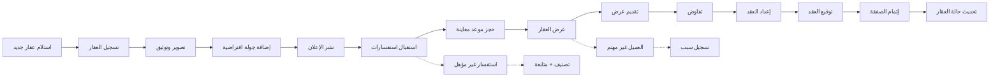
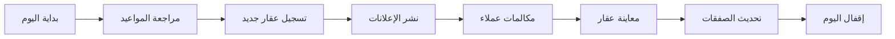

# JOURNEY MAP — RealtyCRM (SAAS-059)
> Owner: Journey Architect · Gate 1 · Persona: مدير المكتب عبدالعزيز

## Flow — Property Management Lifecycle

## Flow — Agent Daily Workflow

## Stage Annotations
| Stage | User Action | Goal | Emotion | Friction | Screen |
|-------|-------------|------|---------|----------|--------|
| تسجيل عقار | إدخال بيانات العقار | توثيق العقار | 😐 عادي | إدخال متكرر | Property Form |
| الإعلان والنشر | نشر على المنصات | جذب العملاء | 😊 راضٍ | منصات متعددة | Listing Publish |
| استقبال العملاء | الرد على الاستفسارات | تحويل لعميل | 🤔 مركز | استفسارات غير مؤهلة | Lead Management |
| المعاينة | عرض العقار | إقناع العميل | 😊 متفائل | عدم جدية العميل | Appointment |
| التفاوض والعقد | الاتفاق على الشروط | إتمام الصفقة | 😟 متوتر | تباين التوقعات | Contract |
| متابعة العمولة | تحصيل الحقوق | تحقيق الإيراد | 😐 عادي | تأخير الدفع | Commissions |

## Ranked Friction Log
1. [High] إدخال بيانات العقار في منصات متعددة يدوياً — حل: نشر موحد، تكامل API مع عقار/بيوت
2. [High] متابعة العملاء والصفقات بدون نظام — حل: CRM متكامل، pipeline مرئي، تذكير
3. [Med] إعداد العقود من الصفر كل مرة — حل: قوالب عقود ذكية، تخصيص سريع
4. [Med] عدم وجود جولات افتراضية — حل: تصوير 360° مدمج، تقليل زيارات غير مجدية
5. [Low] ضعف تقارير أداء السماسرة — حل: لوحة أداء، تقارير إنجاز، عمولات

**Rule:** Every later feature MUST trace to a stage above.
