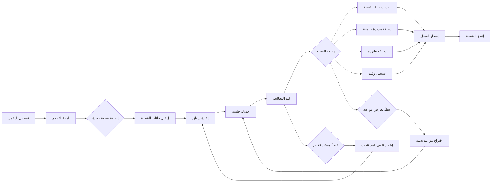

# JOURNEY MAP — LawDesk (SAAS-011)
> Owner: Journey Architect · Gate 1 · Persona: مريم المطيري

## Flow (Mermaid)

## Stage Annotations
| Stage | User Action | Goal | Emotion | Friction | Screen |
|-------|-------------|------|---------|----------|--------|
| تسجيل الدخول | إدخال البريد الإلكتروني وكلمة المرور | الوصول الآمن | محايدة | نسيان كلمة المرور | شاشة الدخول |
| لوحة التحكم | عرض القضايا النشطة والتذكيرات | نظرة شاملة | إيجابية | كثرة المعلومات | لوحة التحكم الرئيسية |
| إضافة قضية | إدخال بيانات الموكل والخصم والجهة | إنشاء ملف القضية | إيجابية | حقول كثيرة | نموذج قضية جديد |
| إرفاق المستندات | رفع ملفات PDF/Word | توثيق الأدلة | محايدة | حجم الملفات الكبير | إدارة المستندات |
| جدولة جلسة | اختيار التاريخ والمحكمة | تنظيم المواعيد | إيجابية | تعارض المواعيد | تقويم الجلسات |
| متابعة القضية | تحديث الحالة والمذكرات | متابعة التقدم | إيجابية | تعدد المهام | شاشة تفاصيل القضية |
| إغلاق القضية | إنشاء تقرير نهائي وإيضاح | إكمال المنظومة | راضية | اكتمال البيانات المطلوبة | شاشة الإغلاق |

## Ranked Friction Log
1. [High] صعوبة إرفاق مستندات متعددة في وقت واحد
2. [High] عدم وضوح المهل القانونية المتبقية لكل قضية
3. [Med] تكرار إدخال بيانات العميل في كل قضية جديدة
4. [Med] صعوبة البحث عن قضية قديمة بعدة معايير
5. [Low] بطء تحميل لوحة التحكم عند كثرة القضايا

**Rule:** Every later feature MUST trace to a stage above.
