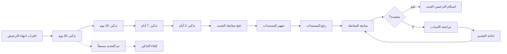
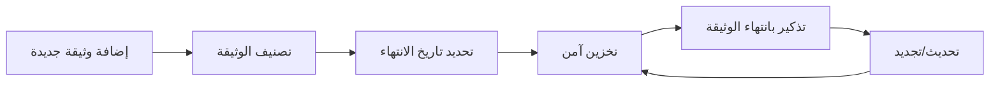

# JOURNEY MAP — WorkPermit (SAAS-060)
> Owner: Journey Architect · Gate 1 · Persona: صاحب الشركة سليمان

## Flow — License Renewal Journey

## Flow — Document Management

## Stage Annotations
| Stage | User Action | Goal | Emotion | Friction | Screen |
|-------|-------------|------|---------|----------|--------|
| استلام التذكير | فتح الإشعار | معرفة التراخيص المنتهية | 😐 منتبه | إشعارات عامة | Dashboard |
| تجهيز المستندات | جمع الأوراق | اكتمال الطلب | 😟 متوتر | عدم وجود الوثيقة | Documents |
| رفع المستندات | تصوير ورفع | إرفاق المطلوب | 😐 عادي | جودة الصورة | Upload |
| متابعة المعاملة | تحديث الحالة | معرفة التقدم | 😟 قلق | إجراءات طويلة | Transaction Tracker |
| دفع الرسوم | إتمام الدفع | إنهاء المعاملة | 😊 راضٍ | خيارات دفع محدودة | Payment |
| استلام الترخيص | تحميل/طباعة | توثيق التجديد | 😊 راضٍ | تأخير الإصدار | Document Vault |

## Ranked Friction Log
1. [High] نسيان تواريخ انتهاء التراخيص ودفع غرامات — حل: تذكير ذكي متعدد المراحل (30-15-7-3 أيام)
2. [High] صعوبة العثور على الوثائق المطلوبة — حل: مستودع منظم، بحث، تصنيف، تذكير بانتهاء الوثائق نفسها
3. [Med] اختلاف إجراءات التراخيص بين الدول — حل: taxonomy مرن، أدلة مخصصة لكل دولة
4. [Med] عدم معرفة خطوات التجديد بالتسلسل — حل: أدلة تفاعلية خطوة بخطوة لكل نوع ترخيص
5. [Low] عدم وجود تحليل لتكاليف التراخيص — حل: تقارير إنفاق، مقارنة سنوية، توفير

**Rule:** Every later feature MUST trace to a stage above.
