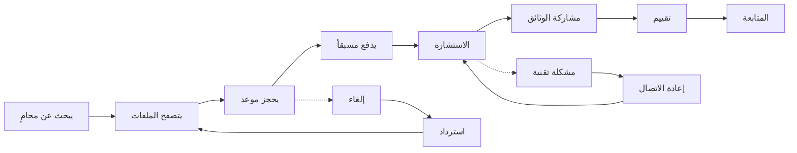

# JOURNEY MAP — LegalConsult (SAAS-071)
> Owner: Journey Architect · Gate 1 · Persona: سامر (Lawyer)

## Flow (Mermaid)

## Stage Annotations
| Stage | User Action | Goal | Emotion | Friction | Screen |
|-------|-------------|------|---------|----------|--------|
| بحث | يكتب التخصص والمدينة | إيجاد محامٍ متخصص قريب | 😊 متفائل | نتائج غير دقيقة | Lawyer List |
| تصفح | يقرأ الملف والتقييمات | اختيار أفضل محامٍ | 🤔 متردد | مقارنة صعبة | Lawyer Profile |
| حجز | يختار الموعد المناسب | حجز موعد بسرعة | 😊 سريع | مواعيد غير متاحة | Book Calendar |
| دفع | يدخل بيانات الدفع | دفع آمن ومضمون | 😰 قلق | بطاقة مرفوضة | Payment Page |
| استشارة | يتحدث مع المحامي والاجتماع عبر فيديو | حل المشكلة القانونية | 😐 جاد | اتصال ضعيف | Video Call |
| وثائق | يرفع الملفات للمحامي | مشاركة آمنة للوثائق | 😊 مرتاح | ملف كبير جداً | Document Upload |
| تقييم | يكتب تقييماً | مساعدة الآخرين بالاختيار | 😊 إيجابي | لا يوجد حافز | Review Form |
| متابعة | يتلقى تحديثات القضية | متابعة مستمرة | 😐 منتظر | إشعارات مزعجة | Case Timeline |

## Ranked Friction Log
1. [High] نتائج البحث غير دقيقة — لا توجد تصفية بالتخصص الدقيق
2. [High] بعض المحامين يلغون المواعيد في اللحظة الأخيرة
3. [Med] رفع الملفات الكبيرة (أكثر من 25MB) يفشل
4. [Med] عدم توفر مواعيد قريبة للمحامين المشغولين
5. [Low] إشعارات متكررة بعد الاستشارة
6. [Low] التقييم مطلوب إجباري قبل إغلاق الحالة

**Rule:** Every later feature MUST trace to a stage above.
