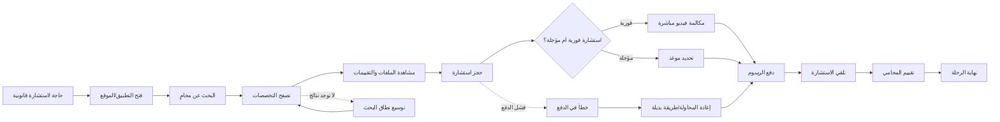

# JOURNEY MAP — LawyerRef (SAAS-091)
> Owner: Journey Architect · Gate 1 · Persona: سارة طالبة الاستشارة

## التدفق (Mermaid)

## شروحات المراحل
| المرحلة | إجراء المستخدم | الهدف | المشاعر | الاحتكاك | الشاشة |
|---------|----------------|-------|---------|----------|--------|
| البحث | إدخال نوع القضية والمدينة | إيجاد محامين ذوي صلة | 😊 متفائل | عام | البحث - Search |
| التصفح | فلترة حسب التخصص والسعر | مقارنة الخيارات | 🤔 فضولي | كثرة النتائج غير المفلترة | القائمة - Results |
| الملف الشخصي | قراءة التقييمات والخبرات | بناء الثقة | 😌 مطمئن | نقص المعلومات | ملف محامٍ - Profile |
| الحجز | اختيار وقت ودفع | تأكيد الموعد | 😬 قلق | تعقيد عملية الدفع | الحجز - Booking |
| الاستشارة | مكالمة فيديو | الحصول على المشورة | 😊 مرتاح | مشاكل تقنية | الاستشارة - Consultation |
| التقييم | تقييم التجربة | مشاركة الرأي | 😊 راضٍ | لا يوجد | التقييم - Review |

## سجل الاحتكاك المرتب
1. [High] تعقيد عملية الدفع للمستخدمين الجدد — تقليل الخطوات + Apple Pay/STC Pay
2. [High] صعوبة الثقة بمحامٍ غير معروف — توثيق هوية + تقييمات موثقة
3. [Med] كثرة نتائج البحث غير المفلترة — تحسين خوارزمية الفلترة + فرز ذكي
4. [Med] مشاكل تقنية في مكالمات الفيديو — اختبار اتصال قبل الاستشارة
5. [Low] نقص المعلومات في بعض الملفات — حقول إلزامية للمحامين
