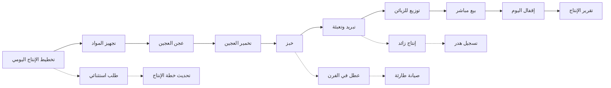
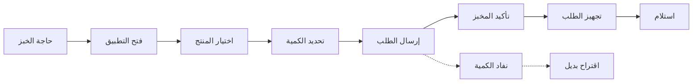

# JOURNEY MAP — BreadChain (SAAS-056)
> Owner: Journey Architect · Gate 1 · Persona: صاحب المخبز الحاج إبراهيم

## Flow — Daily Bakery Production

## Flow — Customer Ordering

## Stage Annotations
| Stage | User Action | Goal | Emotion | Friction | Screen |
|-------|-------------|------|---------|----------|--------|
| تخطيط الإنتاج | تقدير الكميات | إنتاج مضبوط | 🤔 مركز | صعوبة التوقع | Production Plan |
| تجهيز المواد | فحص المخزون | كفاية المواد | 😐 عادي | نقص مفاجئ | Ingredients |
| الإنتاج | متابعة الخبز | جودة وكمية | 🤔 مركز | أعطال مفاجئة | Batch Tracking |
| التوزيع | تحميل وتوصيل | وصول صحيح | 😐 عادي | تأخير توصيل | Distribution |
| البيع | تحصيل المبلغ | إيراد دقيق | 😊 راضٍ | حسابات خاطئة | Sales POS |
| الهدر | تسجيل الفائض | تحسين الكفاءة | 😟 نادم | عدم تسجيل الهدر | Waste Log |

## Ranked Friction Log
1. [High] صعوبة تقدير كميات الإنتاج المطلوبة — حل: توقع آلي بناءً على تاريخ الطلبات والمبيعات
2. [High] هدر كبير في المواد والعجين — حل: تتبع الوصفات بدقة، تسجيل الهدر، تحليلات التحسين
3. [Med] أعطال مفاجئة في الأفران — حل: جدول صيانة دورية، تنبيهات
4. [Med] صعوبة تحصيل حسابات الزبائن — حل: نظام حسابات، حدود ائتمانية، تذكير تلقائي
5. [Low] عدم توثيق وصفات الإنتاج — حل: مكتبة وصفات، حساب تكلفة دقيق

**Rule:** Every later feature MUST trace to a stage above.
