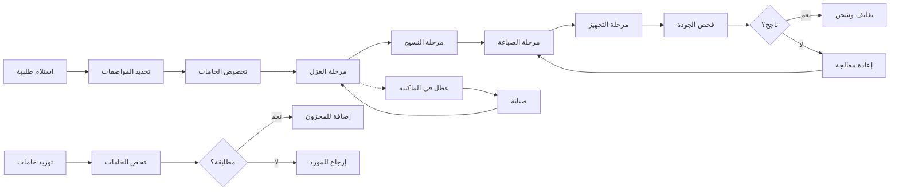

# JOURNEY MAP — TextilePro (SAAS-083)
> Owner: Journey Architect · Gate 1 · Persona: حسن العبدالكريم

## Flow (Mermaid)

## Stage Annotations
| Stage | User Action | Goal | Emotion | Friction | Screen |
|-------|-------------|------|---------|----------|--------|
| استلام طلبية | إدخال مواصفات العميل | تسجيل الطلب | 😐 مجهد | مواصفات دقيقة تحتاج وقت | Production Order |
| تخصيص خامات | اختيار الخامات المناسبة | تجهيز المواد | 😟 قلق | قد لا تكون الخامات متوفرة | Inventory |
| مراحل الإنتاج | تتبع تقدم كل مرحلة | ضمان الالتزام بالجدول | 😊 مراقب | صعوبة معرفة تأخير أي مرحلة | Stage Tracking |
| فحص الجودة | أخذ عينات وفحصها | ضمان الجودة | 😊 راضٍ | معايير الفحص تختلف | Quality Check |
| صيانة ماكينة | تسجيل العطل | إصلاح سريع | 😟 متوتر | قطع الغيار قد لا تتوفر | Machine Monitor |

## Ranked Friction Log
1. [High] تأخير في مرحلة ما يؤثر على كل المراحل التالية — يحتاج Gantt
2. [High] هدر الخامات غير مكتشف حتى نهاية الإنتاج
3. [Med] أعطال الماكينات تكتشف عند بداية الشيفت
4. [Med] جودة الصباغة تتفاوت بين الدفعات
5. [Low] مستندات التصدير تحتاج توقيع جهات متعددة

**Rule:** Every later feature MUST trace to a stage above.
