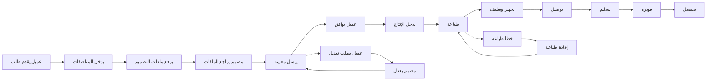

# JOURNEY MAP — PrintHub (SAAS-084)
> Owner: Journey Architect · Gate 1 · Persona: سمير باحاج

## Flow (Mermaid)

## Stage Annotations
| Stage | User Action | Goal | Emotion | Friction | Screen |
|-------|-------------|------|---------|----------|--------|
| تقديم طلب | ملء نموذج الطلب + رفع ملفات | تسجيل الطلب بدقة | 😊 متحمس | الملفات كبيرة الحجم | New Order |
| مراجعة التصميم | فتح المعاينة والتعليق | الموافقة على التصميم | 😐 متوقع | قد لا يرد العميل أياماً | Proof Review |
| إنتاج | بدء الطباعة على الماكينة | إنجاز الطلب | 😊 مركز | أعطال الماكينة المفاجئة | Production |
| توصيل | شحن الطلب للعميل | وصول آمن | 😟 قلق | العميل غير موجود وقت التوصيل | Delivery |
| فوترة | إرسال الفاتورة والتحصيل | تحصيل المبلغ | 😐 مجهد | بعض العملاء يتأخرون في الدفع | Invoicing |

## Ranked Friction Log
1. [High] العملاء لا يردون على المعاينات — تأخير دورة الإنتاج
2. [High] رفع ملفات كبيرة الحجم — فشل الرفع، إعادة إرسال
3. [Med] تغيير المواصفات بعد بدء الإنتاج — إهدار مواد
4. [Med] توصيل الطلب والعميل غير موجود
5. [Low] تأخير تحصيل الدفعات المالية

**Rule:** Every later feature MUST trace to a stage above.
